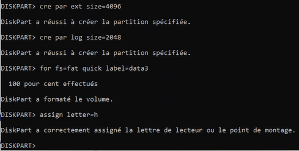

## Commandes DOS

### Commandes de base

/? = Help

[PDF : Commandes\_CMD\_sous\_Windows](/notes/poste-de-travail/_docs/Commandes_CMD_sous_Windows.pdf)

| Commandes                          | Correspondance                                    | Commentaire                                                                               |
| ---------------------------------- | ------------------------------------------------- | ----------------------------------------------------------------------------------------- |
| cd                                 | change directory                                  | cd\ = directement à la racine dossier : explorateur de fichier répertoire : CLI  |
| md                                 | make directory                                    | créer plusieurs répertoires à la fois :  `md test1 test2 test3`                           |
| md directory\subdirectory          | crée toute l'arborescence                         |                                                                                           |
| rd {dir}                           | remove directory                                  |                                                                                           |
| rd {dir} /S                        | rm dir + subdir and files                         |                                                                                           |
| ren {C:\\}{dir} {name}             | rename                                            |                                                                                           |
| move                               | move dir and files                                |                                                                                           |
| xcopy                              | copy directory and files                          | /E =                                                                                      |
| xcopy {source} {destination} /E    | copy directory and subdirectories, and files      |                                                                                           |
| xcopy {source} {destination} /T /E | copy directory, subdirectories, but exclude files |                                                                                           |
| copy                               | copy file                                         |                                                                                           |
| del                                | suppr file                                        |                                                                                           |
| cls                                | clear                                             |                                                                                           |
| dir                                | directories                                       |                                                                                           |
| tree                               | arborescence                                      |                                                                                           |
| tree /f                            | arborescence + fichiers                           | n'affiche pas les fichiers cachés                                                         |
| copy con {file}                    | créer fichier txt                                 | ne pas oublier l'extension mettre ^Z à la fin                                          |
| type {fichier}                     | visualiser le contenu d'un fichier                |                                                                                           |
|                                    |                                                   |                                                                                           |

Un fichier est composé d'un nom+ext

1 octer = 1 byte = 8 bits = 1 caractère txt = 01010101 = A

### Attributs

Sur windows, il existe des attributs de fichiers :

A = Archive (tout est A)

S = Système

H = Hidden (caché)

R = read only (lecture seule)

| Commandes                 | Correspondance                     | Commentaire |
| ------------------------- | ---------------------------------- | ----------- |
| attrib +h note2.txt       | cacher un fichier                  |             |
| attrib                    | voir les fichiers, dont les cachés |             |
| attrib +h +s +r note1.txt | applique les attributs à note1.txt |             |
| attrib -h -s -r note1.txt | retire les attributs à note1.txt   |             |

#### Exercices

1.

6.

Exercice 3 :

### Partager un dossier

Windows xp : 10 connections simultanées

Windows 7 : 20 connections simultanées

Windows server 2022 : connections quasiment iliimitées (2^24) ?

Un serveur de fichier : un ordinateur dans lequel on a partagé un dossier

Qui s'occupe du partage dans un système windows ? le service serveur

Troubleshooting : comprendre le mode de fonctionnement de l'ordinateur

### usage de net share et net use

On execute en tant qu'administrateur :

`net share` = permet de voir les partages

Les partages avec un signe \$ : partages administratifs. Accès uniquement aux admin.

`net share NomDossierPartagé=Chemin_complet`

`net share perou=C:\amerique\perou` = partage par défaut, donc Tout le monde, lecture seule

`net share perou /delete` = suppression du partage

`net share perou=C:\amerique\perou /grant:"Tout le monde",FULL`

**net use**
Permet le mappage de lecteur réseau (raccourcis)
**Attention :** Être en admin peut poser problème

`net use devicename \\computeurname\sharename`

`net use X: \\MONW-001\perou`

`x:` -> permet d'accéder directement au perou, monté à la racine de X

`net use x: \\MONW-001\perou /persistent:yes` = conserver le paramétrage après le redémarrage (obligatoire dans la plupart des cas)

`net use x: /delete` = supprime le mappage de x:

#### Exercices

4. * `md Apple Amazon Microsoft` (etc)
   * `cd Amazon`
   * `copy con Aws.txt` (etc)
   * (en admin)`net share Microsoft=c:\Microsoft /grant:"tout le monde",change`
   * `net share Microsoft` = permet d'afficher la configuration du dossier partagé Microsoft
   * (sans droits admin) `net use x: /delete`
   * `net use z: \\U1\microsoft /persistent:yes`
   * `net use` (pour voir ce qu'on a fait)
   * (en admin)`net user` : <https://www.windows-commandline.com/add-user-from-command-line/>
   * `net user "Steve Job" passw0rd /add` = pour add users. Attention, ce n'est pas la bonne maniière, il faut éviter de mettre les **mdp en clair dans la console**.
   * `net user "Steve Job" * /add` permet de taper le mdp après la commande
   * `net localgroup Inventeur /add` = pour add groupe local users
   * `net localgroup Inventeur "Steve Job" "Bill Gates" /add` = pour add Steve Job au groupe local. On peut cumuler les users comme ici.
   * `net localgroup Inventeur` = affiche la liste des users dans Inventeur
   * `net share Amazon=c:\Amazon /grant:"Steve Job",read /grant:"Bill Gates",read` = ici on a fait user par user (on mets read parce que c'est le paramètrage par défaut et que ce n'est pas proposé)
   * `net share Google=c:\Google /grant:Developpeur,read` = mais c'est plus simple de faire par groupe comme ici
   * (sans admin)`net use P: \\U1\Amazon /persistent:yes`
   * (en admin)`icalcls Amazon /grant:r "bill gate":(oi)(ci)(m)` = permet de ?

Intérêt du groupe : faciliter l'administration système.

### Permissions

**règles** :

1. Les permissions de partage sont cumulatives (exemple, Steve Job fait partie du groupe Inventeur. Il hérite des droits de Steve Job ET de Inventeur)
2. Les permissions de sécurité sont cumulatives
3. Dans la combinaison des permissions de sécurité et des permissions de partage, c'est la permissions la plus restrictive qui s'applique. (Exemple : voir vidéo)
4. Refuser (r) à la priorité sur toutes les permissions
5. Les permissions sur les fichiers sont prioritaires sur les dossiers

Une astuce pour éviter les erreurs: à chaque fois que l'on met un truc dans Partage, on le mets dans l'onglet Sécurité avec les droits correspondants.

L'onglet sécurité peut porter 3 noms : Permissions de sécurité, Permissions New Technology File System (NTFS), permissions locales.

**5 avantages du NTFS (New Technology File System)** :

1. Sécurité (onglet sécurité)
2. Chiffrement (d'un dossier ou du disque)
3. Compression (d'un dossier ou du disque (on ne peut pas faire la compression d'un dossier chiffré et vice-versa))
   (afficher les couleurs : vert chiffré, bleu compressé)
4. Quotas de disque (quotas de disque par utilisateur)
5. Audit Dossiers & fichiers (journalisation, traçabilité)

FAT = FAT16 (partitions inférieures à 2 Go)

FAT32 = (partitions supérieures à 2Go, mais ne copie pas de fichiers supérieurs à 3,5 Go.)

**Il est possible de convertir une partition FAT/FAT32 en NTFS sans pertes de données, mais le contraire n'est pas possible.**
`convert e: /fs:ntfs`

### Gestion des disques

`Disk0` = partition 1

MBR = Secteur de démarrage principal.

* 4 partitions principales max
* 2 to max par partition
* Combinaisons possibles via l'interface graphique :
  * 1PP (Partition Principale)
  * 2PP
  * 3PP
  * 3PP + 1 PE (Partition Etendue) (dans lequel il y a un lecteur logique)
* Combinaisons possibles via DOS à l'aide de la commande `diskpart`
  * 1PP
  * 1PP + 1 PE
  * 2PP
  * 2PP + 1PE
  * 3PP
  * 3PP + 1PE
  * 4PP
    GPT = Guid Partition Table
* 128 Partitions principales
* 18 Eo par partition

On ne peut pas reconvertir en GPT <-> MBR sans supprimer les partitions.

| unité |             | taille |
| ----- | ----------- | ------ |
| 1ko   | kilo-octet  | 1000 o |
| 1mo   | mega-octet  | 1M o   |
| 1go   | terra-octet | ...    |
| 1po   | peta-octet  |        |
| 1eo   | exa-octet   |        |
| 1zo   | zetta octet |        |

### Diskpart

| Commandes | Correspondance   | Commentaire |
| --------- | ---------------- | ----------- |
| diskpart  | partition disque |          |
|           |                  |             |

**étendre les partitions sur un disque de base** :

Windows ne peut pas étendre la partition vers les données vides situées à **gauche**.

Disque dynamique : peut étendre à la fois à droite et à gauche.

Voir vidéo ou powerpoint pour les explications.

Avantages du disque dynamique :

* Raid 1 (raid logiciel)
  * Mirroring (disque miroir)
    ->Tolérance de panne
* Raid 5 (agrégat par bandes avec parité)

Le raid n'est pas une sauvegarde, c'est une tolérance aux pannes.

Préconisations :

* Raid1 pour l'OS (ou Raid10)
* Raid5 pour la data (ou Raid6)

#### Exercices

1. 
   * `diskpart`
   * `list disk`
   * \`\`
2. 
   * Lors de la création de la 4ème partition via Gestion des disques, une partition étendue est crée, dans laquelle est crée la partition logique.

### Compléments DOS

Sur DOS, il y a deux joker :

* `*` qui remplace tous les caractères
* `?` qui remplace un caractère unique

Exemple :

* On va dans `C:\Windows\System32`
* On cherche toutes les extensions qui ont 3 lettres : `dir *.???`

Deux extension qui vont servir tout le temps, pour trouver  :

* `*.cpl` = control panel
  ncpa.cpl = propriétés réseau
  sysdm.cpl = propriétés systèmes
  firewall.cpl
* `dir *.msc` = exention pour MMC = Microsoft Snap-in Control / Microsoft System Control
  diskmgmt.msc
  eventvwr.msc
  lusrmgr.msc
  WF.msc
  compmgmt.msc = computer management, gestion de l'ordinateur
  gpedit.msc =

On peut aussi les ouvrir sans avoir besoin de taper l'extension dans certains cas :

Il y a ce qu'on appelle les variables d'environnement. Sous DOS, ce sont les commandes `SET`, `PATH`, `PATHEXT`.

1. On lance la commande `set`
2. On regarde les lignes :\
   `Path=C:\Windows\system32;`\
   `PATHEXT=.COM;.EXE;.BAT;.CMD;.VBS;.VBE;.JS;.JSE;.WSF;.WSH;.MSC;.PY;.PYW`
3. On peut modifier `PATHEXT` pour ajouter les extensions `.cpl` :\
   `set PATHEXT=.COM;.EXE;.BAT;.CMD;.VBS;.VBE;.JS;.JSE;.WSF;.WSH;.MSC;.PY;.PYW;CPL`
4. On peut désormais taper les commandes en `.cpl` sans l'extension, exemple `ncpa`.

* Toutes les variables d'environnement affichées grâce à `set` peuvent être appellées grâce à `%VARIABLE_ENVIRONNEMENT%`.

Invite de commande / Prompt :

#### Exercices

### Les profils

(voir vidéo)

1. Profil itinérant = Stocké sur le serveur :
   chemin UNC (chemin réseau) : `\\computername\folder_share\%username%` -> onglet profil utilisateur. Partagé sur le `E:\Profil` créé précédemment.
   
2. Profil local = profil par défaut
3. Profil obligatoire = profil qui n'enregistre rien après la fermeture de la session
4. Profil temporaire = erreur de paramétrage

#### TP

* \`\`

### Vocabulaire

Chemin UNC = chemin réseau = `\\ordinateur\dossier_partagé`

MMC = Microsoft Management Console (commande : MMC)

GUI = Graphic User Interface

CLI = Command Line Interface

### Autres commandes

| commande       | commentaire                                                                        |
| -------------- | ---------------------------------------------------------------------------------- |
| `hostname`     | nom de l'ordinateur                                                                |
| `sysdm.cpl`    | accéder aux propriétés système de l'ordinateur (changement de nom de l'ordinateur) |
| `net stop`     | arrêter un service                                                                 |
| `services.msc` | console services                                                                   |
| `lusrmgr.msc`  | console utilisateurs et groupes locaux                                             |
| `mmc`          | Windows Management Console                                                         |
| `diskmgmt.msc` | Gestion des disques                                                                |
| `psr`          | Faire une procédure                                                                |
| \`\`           |                                                                                    |
| \`\`           |                                                                                    |
| \`\`           |                                                                                    |
| \`\`           |                                                                                    |
