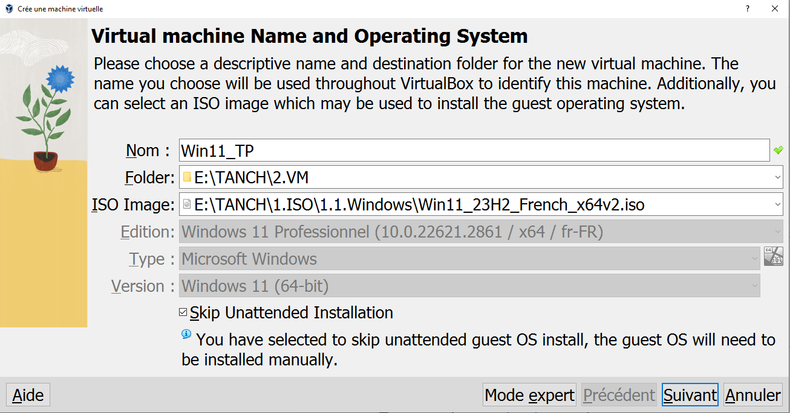
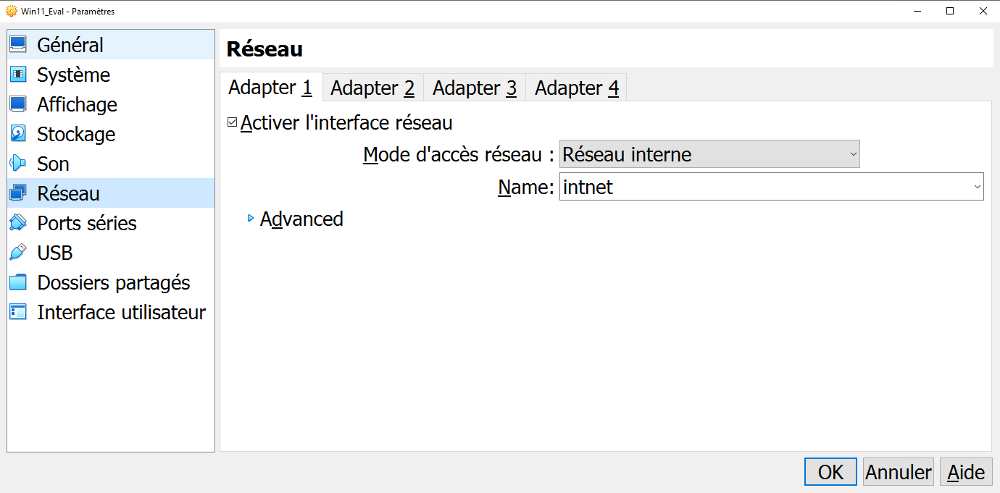
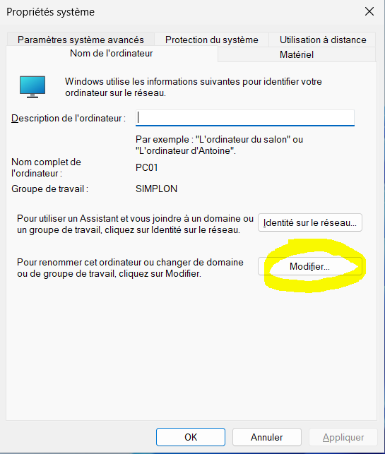
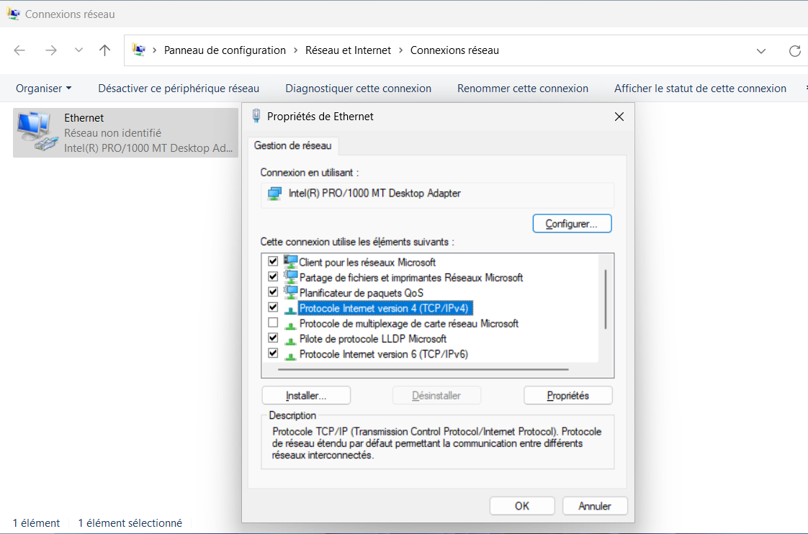
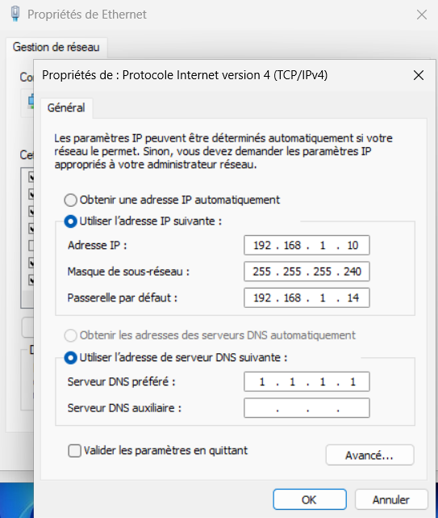

[TP poste de travail (.pdf)](/notes/poste-de-travail/_docs/brief-windows-tssr-66472845d86cb526733562.pdf)

## Exercice 1

:::note[Exercice 1]

1. Installer Windows 11 Pro sous VirtualBox (4 Go de RAM, disque de 50 Go, Réseau Interne)
2. Paramétrer l’ordinateur :
   * Nom hôte : PC01
   * Groupe Travail : Simplon
   * Adresse IP : 192.168.1.10 /28
   * Passerelle : 192.168.1.14
   * DNS : 1.1.1.1

:::

1. * Sur VirtualBox, ne pas oublier de cocher `Skip unattended Installation` :\
     
   * Une fois la VM crée, il faut configurer le réseau en réseau interne :
     
2. * On lance avec `CTRL+R` `sysdm.cpl` pour accéder aux paramètres systèmes. En cliquant sur modifier, on peut changer le nom de l’ordinateur et son groupe de travail, ainsi que son domaine :
     
   * Ensuite, pour modifier les paramètres IP, la passerelle et le DNS, on lance `ncpa.cpl`, on va sur Ethernet > propriétés > Propriétés IPv4 :
       

## Exercice 2

:::note[Exercice 2]
Ajouter un disque de 10 Go et créer 2 partitions de 5 Go chacune sous Dos en Dynamique en MBR :

* E : Data = 4 Go
* F : Backup = 6 Go

:::
