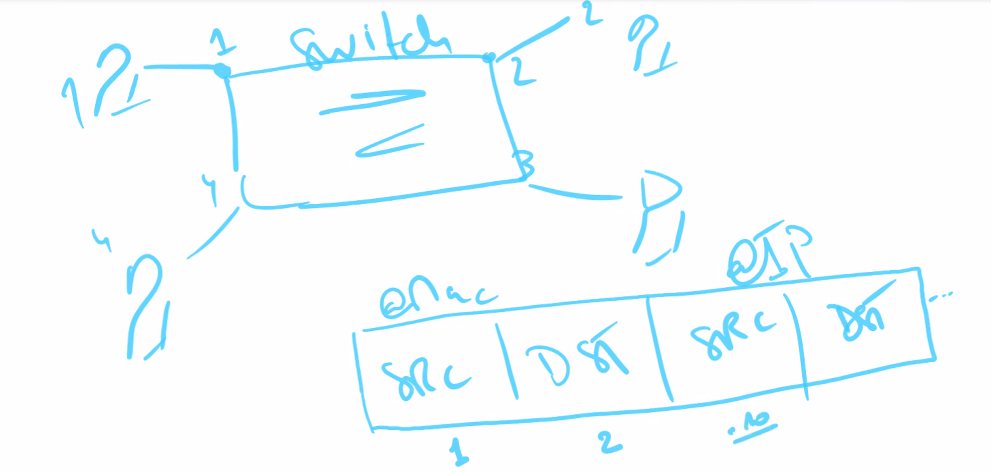
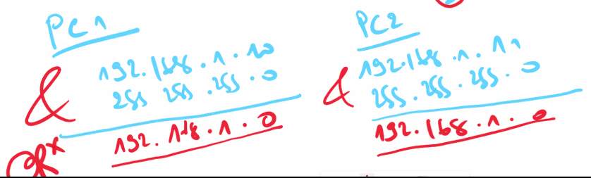

## Couche 2 : Liaison de données

Transmission de trame.

NIC / LIC

NIC : @ physique : MAC

| OUI | N° Série |
| :-: | :------: |

OUI : Organisation Unique Identifier

**Hub** : half duplex. Communiquer chacun leur tour. Fonctionne en broadcast, diffuse à tous les appareils connectés.

Switch :



Le switch calcul l'adresse réseau à partir de l'@ IP et du masque avec un ET logique (&).



Le Switch contient une table d'a@ MAC. En recevant la trame, il lit la trame. @ MAC 1 entre par port 1. Il connaît la source mais pas la destination. Le switch va donc faire un Broadcast.

## Protocole ARP

Contenu du Broadcast : ARP : FFFFFFFFFFFF (12 F) + @ IP destination.

Le PC2, qui correspond à l'adresse IP de destination, va envoyé une trame en unicast avec son adresse MAC.

PC2 : @MAC\@IP

Une fois que le switch à sa table complète, il construit un tunnel entre le port 1 et 2.\
ASIC : (le tunnel) = Application Specific Integrated Circuit.

Au bout de 5 minutes, le switch va effacer les adresses mac inutilisées depuis plus de 300 secondes (?).

## VLAN

Une VLAN est un cloisonnement. Une partie des ports appartiennent à une VLAN, une autre partie à l'autre.


Code pour le switch :

```txt
SW1
====
en
conf t
hostname SW1

vlan 10
name IT

vlan20
name RH

int range f0/1-10
switchport mode acces
swi acces vlan 10

int range f0/11-20
switchport mode acces
swi acces vlan 20

int g0/1
switchport mode trunk
```

```txt
SW1
====
show MAC-address-table 
```

Mode access : 1 interface appartient à un VLAN et un seul\
Mode trunk : tout le monde peut passer à travers la même interface

Lorsque l'on a deux switchs interconnectés, il faut mettre l'interface qui les connectes en mode trunk pour leur permettre de transférer les communications de plusieurs vlan sur le même interface.

```
int g0/1
switchport mode trunk
do show interface trunk
```

```txt
SW2
====
en
conf t
hostname SW2

vlan 10
name IT

vlan 20
name RH

int range f0/1-10
switchport mode acces
swi acces vlan 10

int range f0/11-20
switchport mode acces
swi acces vlan 20

int g0/1
switchport mode trunk
```

Le vlan 10 et 20 ne peuvent pas communiquer. Il leur manque une passerelle, et un routeur pour router les communications.

On rencontre le même problème avec le routeur qu'avec le second switch : il faut faire passer les communications de plusieurs vlan sur une seule interface. On crée donc des interfaces virtuelles, dédiées à chaque vlan.

```txt
SW2
====
int g0/2
switchport mode trunk
```

```txt
RT1
====
en
conf t
hostname RT1

int g0/0
no shutdown

int g0/0.10
encapsulation dot1Q 10
ip add 192.168.10.254 255.255.255.0
exit

int g0/0.20
encapsulation dot1Q 20
ip add 192.168.20.254 255.255.255.0

```

## Projet

```txt
RT-Marseille-1
====
en
conf t
hostname RT-Marseille-1

int g0/0
no shutdown

int g0/0.101
encapsulation dot1Q 101
ip add 10.13.1.254 255.255.254.0
ip helper 10.13.4.1
ip ospf 1 area 0

int g0/0.102
encapsulation dot1Q 102
ip add 10.13.2.254 255.255.255.0
ip helper 10.13.4.1
ip ospf 1 area 0

int g0/0.103
encapsulation dot1Q 103
ip add 10.13.3.254 255.255.255.0
ip helper 10.13.4.1
ip ospf 1 area 0

int g0/0.104
encapsulation dot1Q 104
ip add 10.13.4.30 255.255.255.224
ip helper 10.13.4.1
ip ospf 1 area 0
```

```txt
RT-Paris-1
====

en
conf t
hostname RT-Paris-1

interface GigabitEthernet0/2
no shut
ip address 31.31.31.2 255.255.255.252
ip ospf 1 area 0

interface GigabitEthernet0/1
no shut
ip address 13.13.13.2 255.255.255.252
ip ospf 1 area 0

interface G0/0
no shut
ip add 10.75.0.254 255.255.255.0
ip ospf 1 area 0
```

```txt
RT-Marseille-1
====
en
conf t
host RT-Marseille-1

interface GigabitEthernet0/1
no shut
ip address 13.13.13.1 255.255.255.252
ip ospf 1 area 0
```

### Création d’un Vlan de gestion

On crée une VLAN de gestion :

```txt
SW-Marseille-1
====
en
conf t

vl 99
name gestion

```

On va donner au switch une adresse IP de gestion. Ici, `10.13.99.254` :

```txt
int vl 99
no shut
ip add 10.13.99.254 255.255.255.0
```

Ensuite, on crée un user `admin` :

```txt
username admin privilege 15 password admin
```

:::note[Info]
le `privilege 15` veut dire : tous les droits
:::

```txt
ip domain-name mars.net
crypto key generate rsa general-keys modulus 1024

line vty 0 4
login local
transport imput ssh
```

```txt
int g0/2
switchport trunk native vlan 99
```

## Commandes utiles

|            Commande            |                        Commentaire                       |
| :----------------------------: | :------------------------------------------------------: |
|           `show run`           |          Afficher tous les paramètres du routeur         |
|     `show interface trunk`     |             Afficher les interfaces trunkées             |
|         `show ip ospf`         |                            Aff                           |
|           `show vlan`          |                     Affiche les vlan                     |
| `show crypto key mypubkey rsa` | Affiche la clé publique générée par `crypto key gen rsa` |
|    `show ip interface brief`   |                                                          |
|              \`\`              |                                                          |
