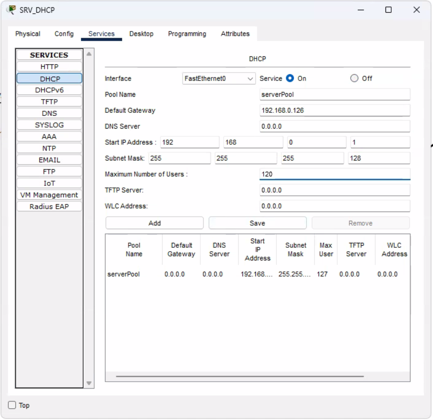
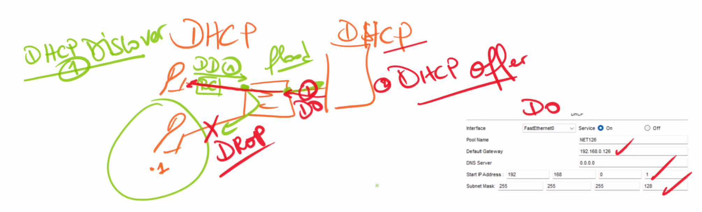
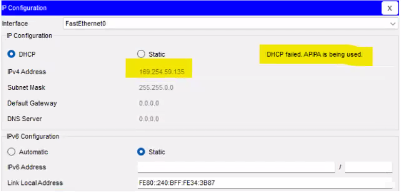
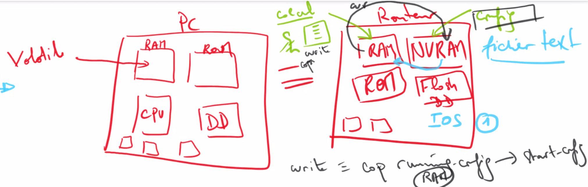

## Routage statique

Routage : def

**Coût** en km (ou **métrique**): Je suis à Paris, je veux aller jusqu'à Marseille. Je dois passer par R1, R3, R5. Ou R1, R2, R5. On va chercher le moindre coût (en km).


|                                     R1                                    |                             R2                             | R4                                      | R5                                                                                                                   |
| :-----------------------------------------------------------------------: | :--------------------------------------------------------: | --------------------------------------- | -------------------------------------------------------------------------------------------------------------------- |
|                      R1 -> R2 = 4<br>R1 -> R4 = 3<br>                     |                 R2 - R1 = 4<br>R2 - R5 = 2                 | R4 - R1 = 3                             | R5-R2=2<br>                                                                                                          |
| R1 -> R5 :<br>R1 -> R3 -> R5 = 6<br>R1-R2-R4 = 6<br>R1-> R3-> R2-> R5 = 6 | R2 -> R4 :<br>R2 - R1 - R4 = 7<br>R2 - R3 -R1 - R4 = 7<br> | R4 -> R5 :<br>R4 - R1 - R2 - R5 = 9<br> | R5 -> R1: <br>R5-R2-R1=2+4=6<br>R5-R3-R1=4+2=6 <br><br>R5 -> R4 : <br>R5-R1-R3-R4=4+2+3=9<br>R5-R2-R1-R4=2+4+3=9<br> |

**Routage statique :** manuel. C'est l'admin réseau (ou l'architecte) qui détermine les routes à prendre. Lorsque l'on a plusieurs routeurs, la configuration devient fastidieuse.

Même schéma sur cisco :


* DHCP
* DNS
* Serveur mail
* Serveur web

## DHCP

* DHCP sur Cisco :
  
  * On renomme serverPool et on appuie sur add.
  * On mets serverPool à 0

DD = DHCP Discover = Première requête lancée par un client (en Broadcast). Il va inonder tous les ports sauf celui par lequel il est sorti. On appelle ça un flood / inondation (en vert):


Etant donné que l'ordinateur 1 n'est pas configuré en DHCP, il va faire un drop (refus).

Le serveur DHCP réponds avec un DO = DHCP Offer. Il va lui offrir (en rouge):

* Une adresse IP à partir de 1
* Le masque
* Le gateway
* Pas de DNS car pas configuré
  
  Le serveur DHCP va aussi ping PC1 pour savoir si l'adresse est prise (uniquement l'adresse qu'il s'apprêtait à donner).

DD = DHCP Discover\
DO = DHCP Offer\
DR : DHCP Request = Requête\
DA : DHCP ACK = Acknowledgment

Moyen mnémotechnique : **DORA**

Dans le cas où il y a plusieurs serveurs DHCP : C'est le serveur qui réponds le plus rapidement qui gagne.

Dans le cas où il n'y a pas de serveur DHCP, le PC envoie 3 request. Si elles sont négatives, il s'auto-attribue une adresse APIPA (169.254..)



## Configuration routeur

**Configuration RT-4** (Routeur 4)

```txt
router> (mode setup/execution)
> enable
router#> (mode privilege)
> configure terminal
> hostname RT-4 // changer de hostname 
> do write // sauvegarder la consigne
```

:::note
Il est possible de "résumer" les commandes. On peut faire `en` pour `enable`, `conf t` pour `configure terminal`.
:::

***

Aparté :\
Lorsque l'on reçois le routeur, la configuration se fait sur la NVRAM.\
Les calculs se font sur la RAM.\
Quand on fait un `write` ou un `copy running-config`, ça l'envoie à la NVRAM (`start-config`). Au démarrage, toute la config de la NVRAM va sur la RAM.

Toute la configuration : se trouve sur un fichier txt.



***

On continue sur la configuration de RT4 :

```txt
RT-4 #> show ? // affiche la liste des commandes possibles pour show
> show running-config // show run : pour voir la configuration

en
conf t
hostname RT-4

int g0/0
no shutdown
% Interface g0/0 changed state to up
ip address 192.168.0.126 255.255.255.128
exit

int g0/1
no shut
ip add 192.168.0.161 255.255.255.252
```

:::note
Sur Cisco, il est possible de faire un copier-coller du fichier txt du routeur et de coller la config sur un autre routeur.
:::

```txt
do sh ip int br // sow ip interface brief
```

## Glossaire

|   Mot FR   |  Mot EN | Définition |
| :--------: | :-----: | ---------- |
| Passerelle | Gateway |            |
|            |         |            |
|            |         |            |
|            |         |            |
|            |         |            |
|            |         |            |
|            |         |            |
