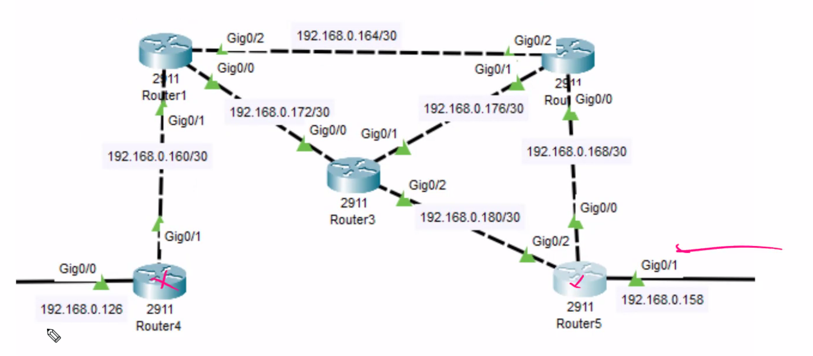
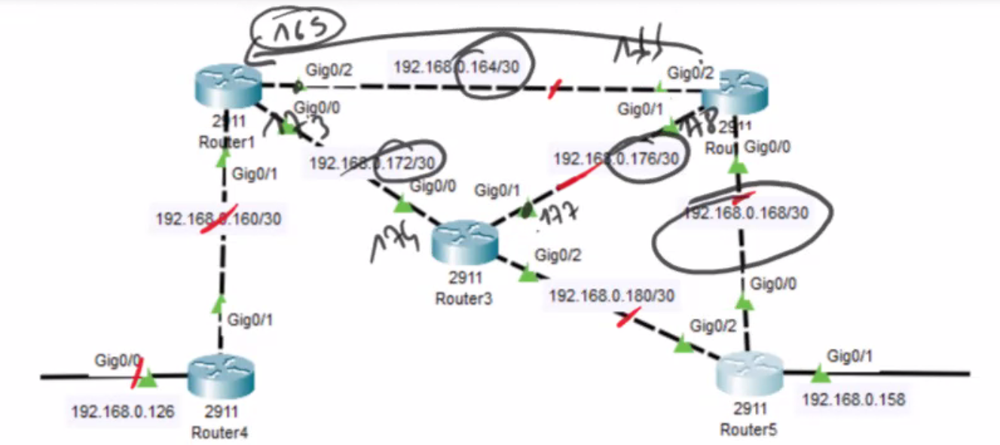

## Routage statique

Routage : def

**Coût** en km (ou **métrique**): Je suis à Paris, je veux aller jusqu'à Marseille. Je dois passer par R1, R3, R5. Ou R1, R2, R5. On va chercher le moindre coût (en km).


|                                     R1                                    |                             R2                             | R4                                      | R5                                                                                                                   |
| :-----------------------------------------------------------------------: | :--------------------------------------------------------: | --------------------------------------- | -------------------------------------------------------------------------------------------------------------------- |
|                      R1 -> R2 = 4<br>R1 -> R4 = 3<br>                     |                 R2 - R1 = 4<br>R2 - R5 = 2                 | R4 - R1 = 3                             | R5-R2=2<br>                                                                                                          |
| R1 -> R5 :<br>R1 -> R3 -> R5 = 6<br>R1-R2-R4 = 6<br>R1-> R3-> R2-> R5 = 6 | R2 -> R4 :<br>R2 - R1 - R4 = 7<br>R2 - R3 -R1 - R4 = 7<br> | R4 -> R5 :<br>R4 - R1 - R2 - R5 = 9<br> | R5 -> R1: <br>R5-R2-R1=2+4=6<br>R5-R3-R1=4+2=6 <br><br>R5 -> R4 : <br>R5-R1-R3-R4=4+2+3=9<br>R5-R2-R1-R4=2+4+3=9<br> |

**Routage statique :** manuel. C'est l'admin réseau (ou l'architecte) qui détermine les routes à prendre. Lorsque l'on a plusieurs routeurs, la configuration devient fastidieuse.

Même schéma sur cisco :


* DHCP
* DNS
* Serveur mail
* Serveur web

## DHCP

* DHCP sur Cisco :
  
  * On renomme serverPool et on appuie sur add.
  * On mets serverPool à 0

DD = DHCP Discover = Première requête lancée par un client (en Broadcast). Il va inonder tous les ports sauf celui par lequel il est sorti. On appelle ça un flood / inondation (en vert):


Etant donné que l'ordinateur 1 n'est pas configuré en DHCP, il va faire un drop (refus).

Le serveur DHCP réponds avec un DO = DHCP Offer. Il va lui offrir (en rouge):

* Une adresse IP à partir de 1
* Le masque
* Le gateway
* Pas de DNS car pas configuré
  
  Le serveur DHCP va aussi ping PC1 pour savoir si l'adresse est prise (uniquement l'adresse qu'il s'apprêtait à donner).

DD = DHCP Discover\
DO = DHCP Offer\
DR : DHCP Request = Requête\
DA : DHCP ACK = Acknowledgment

Moyen mnémotechnique : **DORA**

Dans le cas où il y a plusieurs serveurs DHCP : C'est le serveur qui réponds le plus rapidement qui gagne.

Dans le cas où il n'y a pas de serveur DHCP, le PC envoie 3 request. Si elles sont négatives, il s'auto-attribue une adresse APIPA (169.254..)


## Configuration routeur (addressage)

**Configuration RT-4** (Routeur 4)

```txt
router> (mode setup/execution)
> enable
router#> (mode privilege)
> configure terminal
> hostname RT-4 // changer de hostname 
> do write // sauvegarder la consigne
```

:::note
Il est possible de "résumer" les commandes. On peut faire `en` pour `enable`, `conf t` pour `configure terminal`.
:::

***

Aparté :\
Lorsque l'on reçois le routeur, la configuration se fait sur la NVRAM.\
Les calculs se font sur la RAM.\
Quand on fait un `write` ou un `copy running-config`, ça l'envoie à la NVRAM (`start-config`). Au démarrage, toute la config de la NVRAM va sur la RAM.

Toute la configuration : se trouve sur un fichier txt.


***

On continue sur la configuration de RT4 :

```txt
RT-4 #> show ? // affiche la liste des commandes possibles pour show
> show running-config // show run : pour voir la configuration

en
conf t
hostname RT-4

int g0/0
no shutdown
% Interface g0/0 changed state to up
ip address 192.168.0.126 255.255.255.128
exit

int g0/1
no shut
ip add 192.168.0.161 255.255.255.252
```

:::note
Sur Cisco, il est possible de faire un copier-coller du fichier txt du routeur et de coller la config sur un autre routeur.
:::

```txt
do sh ip int br // sow ip interface brief
```

On a terminé l'adressage sur toutes les machines (voir vidéo). Maintenant, on peut commencer la partie routage.

**Route par défaut** : on dit qu'une route est une route par défaut quand il y a un seul chemin à suivre par le routeur. Exemple : une box internet est une route par défaut.
Pour aller n'importe où je dois passer par 162 (dans l'exemple).

## Configuration routeur (routage)

```txt
RT-4
 
conf t 
ip route IPDestination MasqueDestination Passerelle
```

**Réseau isolé** : un réseau qui n'a qu'une seule route (route par défaut).

:::caution
Le coût d'un chemin statique = 1
Le coût d'une route par défaut = 5 (ou 2?)
Le coût d'une connexion directe = 0
:::

```txt
RT-5

en
conf t
ip route 0.0.0.0 0.0.0.0 192.168.0.181
ip route 0.0.0.0 0.0.0.0 192.168.0.169
```



RT-2 :

|  Destination  | Masque | Gateway   | Type     |
| :-----------: | :----: | --------- | -------- |
|  192.168.0.0  |   /25  | 164 / 177 | Static   |
| 192.168.0.160 |   /30  | 164       | S        |
| 192.168.0.164 |   /30  | -         | Connecté |
| 192.168.0.168 |   /30  | -         | C        |
| 192.168.0.172 |   /30  | 177       | S        |
| 192.168.0.176 |   /30  | -         | C        |
| 192.168.0.180 |   /30  | 177 / 170 | S        |
| 192.168.0.128 |   /27  | 170       | S        |

```txt
RT-2
======
ip route 192.168.0.0 255.255.255.128 192.168.0.165
ip route 192.168.0.160 255.255.255.252 192.168.0.165
ip route 192.168.0.172 255.255.255.252 192.168.0.181
ip route 192.168.0.180 255.255.255.252 192.168.0.177
ip route 192.168.0.128 255.255.255.252 192.168.0.170

do sh ip route
```

RT-1 :

|  Destination  | Masque | Gateway |
| :-----------: | :----: | ------- |
|  192.168.0.0  |   /25  |         |
| 192.168.0.160 |   /30  |         |
| 192.168.0.164 |   /30  |         |
| 192.168.0.168 |   /30  |         |
| 192.168.0.172 |   /30  |         |
| 192.168.0.176 |   /30  |         |
| 192.168.0.180 |   /30  |         |
| 192.168.0.128 |   /27  |         |

```txt
RT-1
=======
ip route 192.168.0.0 255.255.255.128 192.168.0.161
ip route 192.168.0.168 255.255.255.252 192.168.0.166
ip route 192.168.0.176 255.255.255.252 192.168.0.174

ip route 192.168.0.180 255.255.255.252 192.168.0.174
ip route 192.168.0.128 255.255.255.224 192.168.0.166
ip route 192.168.0.128 255.255.255.224 192.168.0.174

```

On a une erreur au copié-collé :

```
no ip route ip route 192.168.0.128 255.255.255.224 192.168.0.165 // pour supprimer
ip route 192.168.0.128 255.255.255.224 192.168.0.166
```

RT-3 :

|  Destination  | Masque | Gateway |
| :-----------: | :----: | ------- |
|  192.168.0.0  |   /25  |         |
| 192.168.0.160 |   /30  |         |
| 192.168.0.164 |   /30  |         |
| 192.168.0.168 |   /30  |         |
| 192.168.0.172 |   /30  |         |
| 192.168.0.176 |   /30  |         |
| 192.168.0.180 |   /30  |         |
| 192.168.0.128 |   /27  |         |

```txt
RT-3
=======
ip route 192.168.0.0 255.255.255.128 192.168.0.173

ip route 192.168.0.168 255.255.255.252 192.168.0.178
ip route 192.168.0.168 255.255.255.252 192.168.0.182

ip route 192.168.0.164 255.255.255.252 192.168.0.178
ip route 192.168.0.164 255.255.255.252 192.168.0.173

ip route 192.168.0.160 255.255.255.252 192.168.0.173

ip route 192.168.0.128 255.255.255.224 192.168.0.178
ip route 192.168.0.128 255.255.255.224 192.168.0.182
```

```
tracert
```

On a une erreur en faisant tracert

```txt
sh run | se ip route // permet de filtrer le contenu de sh run et ne montrer que les ip route
```



Astuce : aller du haut vers le bas plus petit au plus grand, et de la gauche vers la droite, plus petit au plus grand.

AD = Administrative Distance : Rapport avec le coût.

**TTL** = Time to Live = nombre de sauts (255-2 =253)


## Glossaire

|   Mot FR   |  Mot EN | Définition |
| :--------: | :-----: | ---------- |
| Passerelle | Gateway |            |
|            |         |            |
|            |         |            |
|            |         |            |
|            |         |            |
|            |         |            |
|            |         |            |
