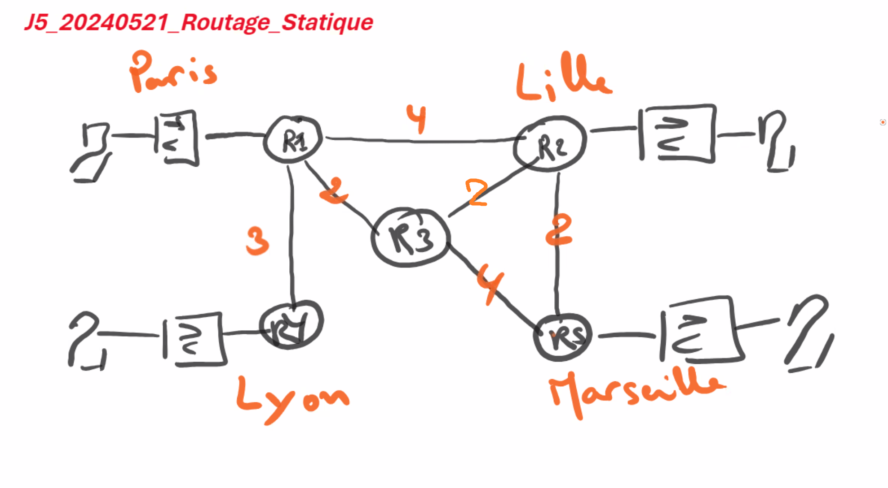
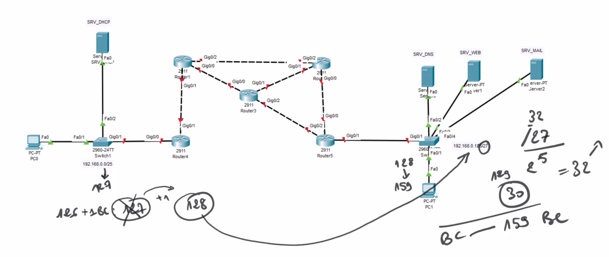
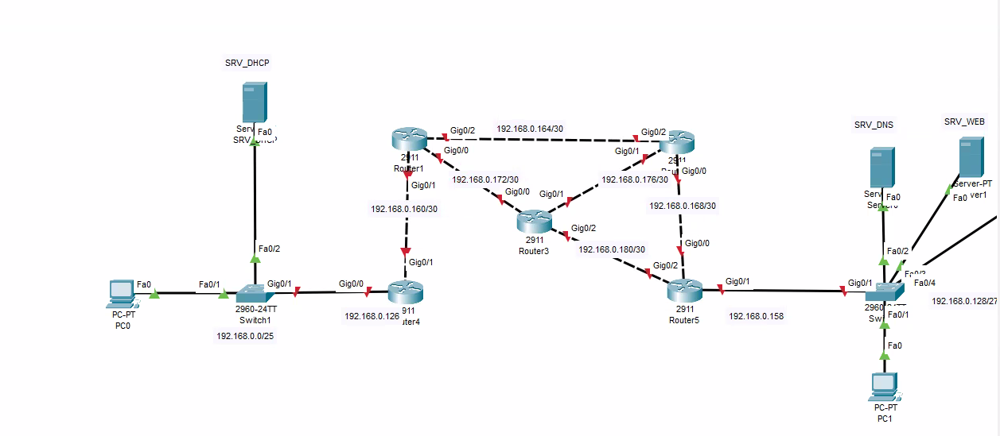

## Routage statique

Routage : def

**Coût** en km (ou **métrique**): Je suis à Paris, je veux aller jusqu'à Marseille. Je dois passer par R1, R3, R5. Ou R1, R2, R5. On va chercher le moindre coût (en km).

|                                     R1                                    |                             R2                             | R4                                      | R5                                                                                                                   |
| :-----------------------------------------------------------------------: | :--------------------------------------------------------: | --------------------------------------- | -------------------------------------------------------------------------------------------------------------------- |
|                      R1 -> R2 = 4 R1 -> R4 = 3                      |                 R2 - R1 = 4 R2 - R5 = 2                 | R4 - R1 = 3                             | R5-R2=2                                                                                                           |
| R1 -> R5 : R1 -> R3 -> R5 = 6 R1-R2-R4 = 6 R1-> R3-> R2-> R5 = 6 | R2 -> R4 : R2 - R1 - R4 = 7 R2 - R3 -R1 - R4 = 7  | R4 -> R5 : R4 - R1 - R2 - R5 = 9  | R5 -> R1:  R5-R2-R1=2+4=6 R5-R3-R1=4+2=6   R5 -> R4 :  R5-R1-R3-R4=4+2+3=9 R5-R2-R1-R4=2+4+3=9  |

**Routage statique :** manuel. C'est l'admin réseau (ou l'architecte) qui détermine les routes à prendre. Lorsque l'on a plusieurs routeurs, la configuration devient fastidieuse.

Même schéma sur cisco :

* DHCP
* DNS
* Serveur mail
* Serveur web
