```
3 parties :
```

* ITL
* Une partie du second
* Une partie du troisième

## Première semaine

**Sommaire :**

* J1,J2,J3 - Modèle OSI
* J4 - Restitution

### Modèle OSI

[Exo1 modèle OSI](</notes/réseaux/_docs/Exo1 modèle OSI.pdf>)

OSI = Open System Interconnection

Créé pour standardiser.

Avant 1984. La non-standardisation pénalise le dev de l'informatique. Pénalise aussi au niveau financier (public captif). Les OS étaient liées au hardware, donc chaque logiciel dépendait d'un constructeur spécifique (HP, IBM, etc.).

Le modèle OSI sépare le Hardware du Software.

C’est un cahier des charges pour les constructeurs.

**OSI**
Partout Le Roi Trouve Sa Place Assise


7 - Application

6 - Présentation

5 - Session

4 - Transport

3 - Réseau

2 - Liaison de données

1 - Physique


**Questions que l’on va se poser :**

1. Nom / n°
2. Fonction de la couche ?
3. Protocoles ?
4. Interactions entre la couche supérieure et inférieure ?
5. Quels matériels ou logiciels sont liés à chaque couche ?

#### 7 - Application

2. La couche app est très proche de l'utilisateur. Rends un service à l'user. Interaction entre couche applicative et l'user.
3. SSH/ FTP/ HTTPs / SMTP (mail) / DNS, DHCP
4. Exemple : SSH. On saisi une adresse IP et un mdp. C'est envoyé à 6)
   Le nom du message qui circule au niveau de la couche 7-6-5 = **Data**.
   On appelle cela l'encapsulation / PDU. Le nom de l'information qui circule, pas un paquet. (Encapsulation : rajouter un en-tête et une queue à la data). Lorsque l'on a encapsulé la donnée, cela devient un segment dans la couche 4, Transport.
5. Logiciels, applications, processus,

#### 6 - Présentation

2. Présentation du message, formatage, traduction du message en langage machine.
   
   Message : écris en ASCII.
   * Traduis en langage machine
   * Peut chiffrer
   * Compression
3. ...
4. Exemple SSH : Formate l'adresse IP et chiffre le mdp

#### 5 - Session

2. Ouvrir un canal. Communication Client /Server
   * Ouverture / fermeture de session
   * Définir la manière de communiquer
     3 types de communication :
     * Simplex (Unidirectionnelle)
       Ex: Radio. Antivirus, mise à jour.
     * Half-duplex (Semi-directionnel, bidirectionnel asynchrone, chacun son tour)
       Exemple de la vie réelle : Talkie-Walkie
       Imprimante
     * Full duplex (Bidirectionnel synchrone)
       Appels téléphoniques, VOIP
3. Exemple SSH : Ouvre la session SSH

#### 4 - Transport

2. Pour ouvrir une session SSH, il faut ouvrir un port. Il s'ouvre sur la partie transport.
   Pour ouvrir google.com, le système va utiliser le port 80 ou 443. Si le port n'est pas ouvert, ça ne fonctionne pas. Ouverture des ports.
   * Participe à l'ouverture / fermeture de session.
3. UDP / TCP
   \- UDP : lettre standard : sans accusé de réception
   \- TCP : lettre avec accusé de réception
4. 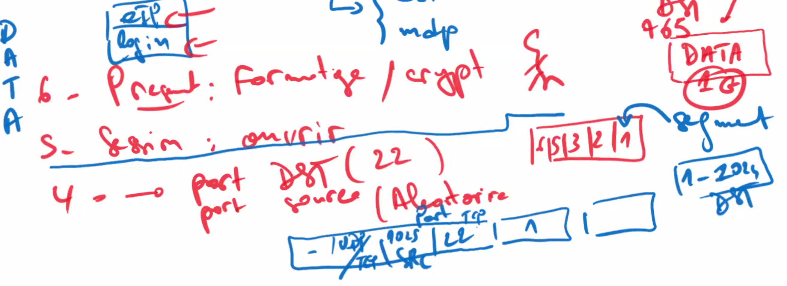
   Data encapsulée : deviens un segment.

#### 3 - Réseau

2. Adressage et routage.
   * Adressage : IPv4, IPv6
   * Routage : Statique, dynamique
3. IPv4, IPv6
4. Segment : rajoute en-tête avec adresse IP et autres données. Deviens un **paquet IP**.
   
5. Firewall / Routeur/ Switch niv.3

#### 2 - Liaison de données

2. Carte réseau. Saisis le meilleur moment pour recevoir ou pour envoyer.
   * Adresse MAC
3. VLAN / STP / PPP / x25...
4. Encapsule le paquet IP avec en-tête et queue. : Adresse MAC.
   Cela devient une **Trame**.
5. Pont / Switch, NIC, CIC, WIC ...

#### 1 - Physique

2. Wifi : Ondes radio. Câble RJ45 : signal électromagnétique. Fibre : Lumière.
3. WIFI
4. Transforme la trame avec un signal donné : **encapsulation en Bit**.
5. Câblage RJ45, Coaxial...

PDU (Protocol Data Unit) / Encapsulation

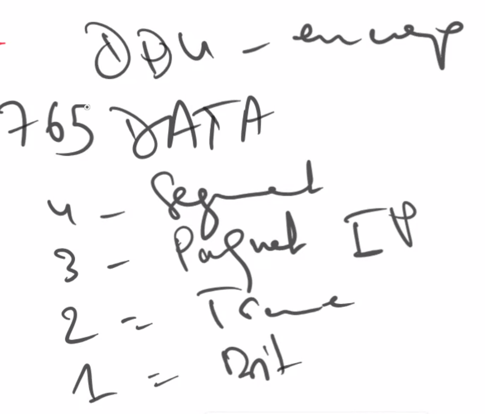

Résumé

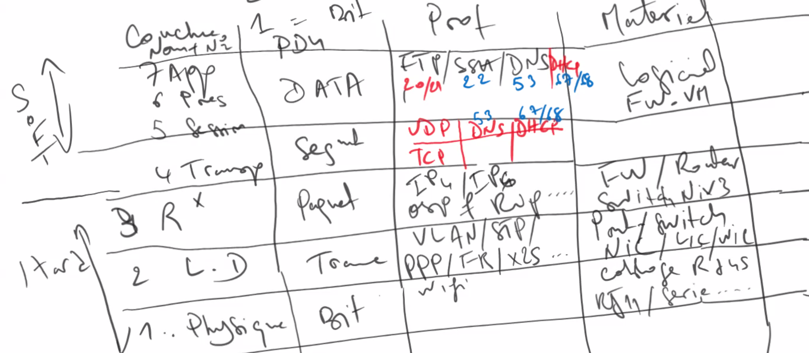

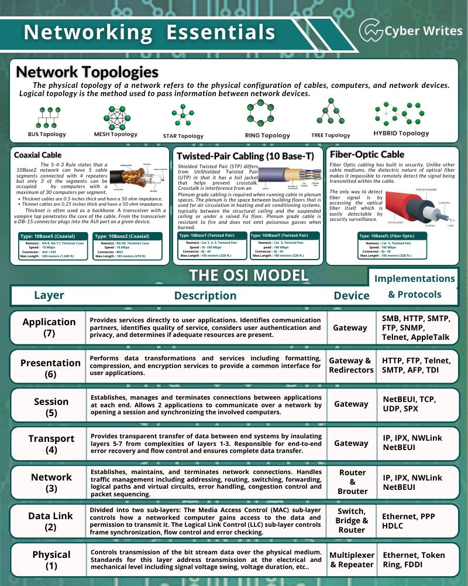

4 : CRC = Contrôle de Redondance Cyclique (Queue) = résultat : Checksum

2 : Notification d'erreur sur la couche 2.

Adresse IP = Adresse logique

### Classes d'adresses

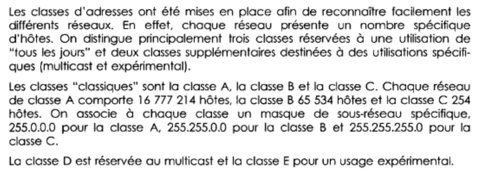

Classe ABC + D

D = Multicast (exemple : zoom )

Unicast = 1 to 1

Multicast = un groupe = 1 to some

Broadcast = tout le monde = 1 to any

A = 255.0.0.0


Par défaut, la classe A correspond à 8, B à 16, C à 24.

Dans 1 réseau, on a une partie réseau, une partie Broadcast

C'est le masque qui détermine la partie réseau et la partie hôte.

### Calcul des masques

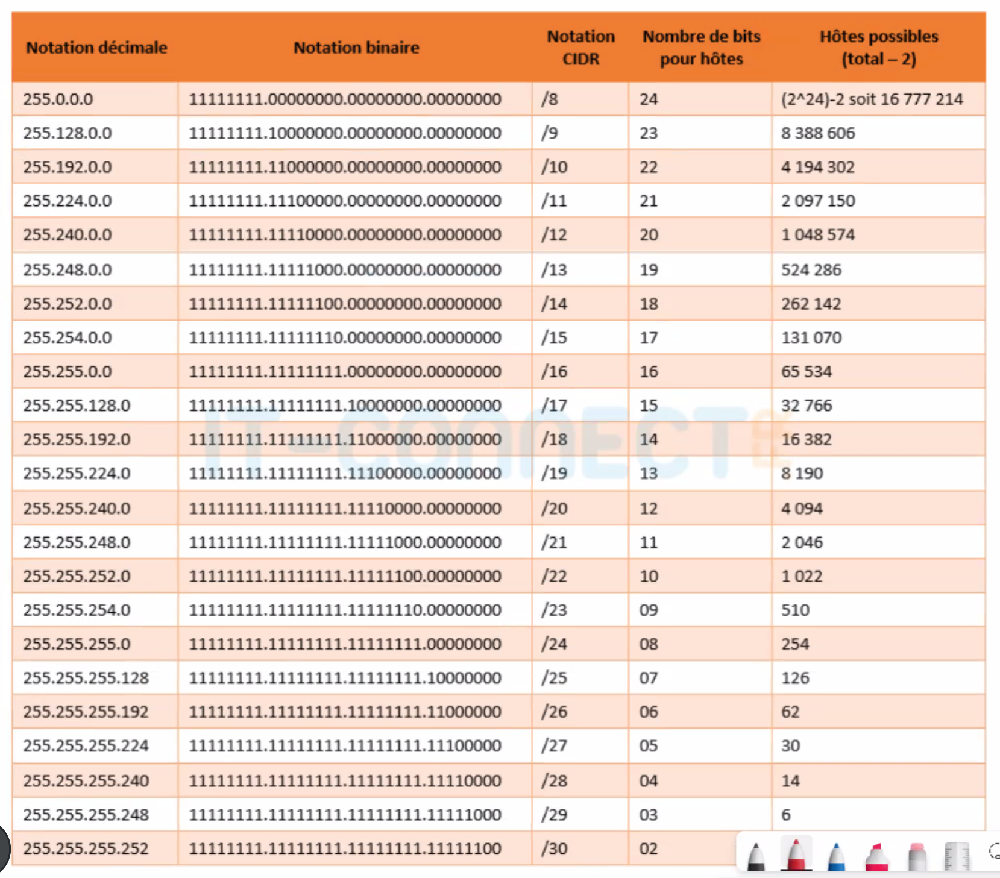

### IPv4

Codé sur 32 bits. 4 octets.

2^32 : 4M + un petit chouia

En 1995, on a senti qu'il y allait avoir une pénurie (Boum internet).

Solution : IPv6.

2^128

Problème :

* En 30 ans, IPv6 n'est toujours pas implémentée sur tous les systèmes.
* Besoin de la tester (failles de sécurité)

Solution intermédiaire :

On récupère 3 classes d'adresses.

A : Hosts : 2^24 = 16 M

B : Hosts : 2^16 = 65 536

C : Hosts : 2^8 = 255

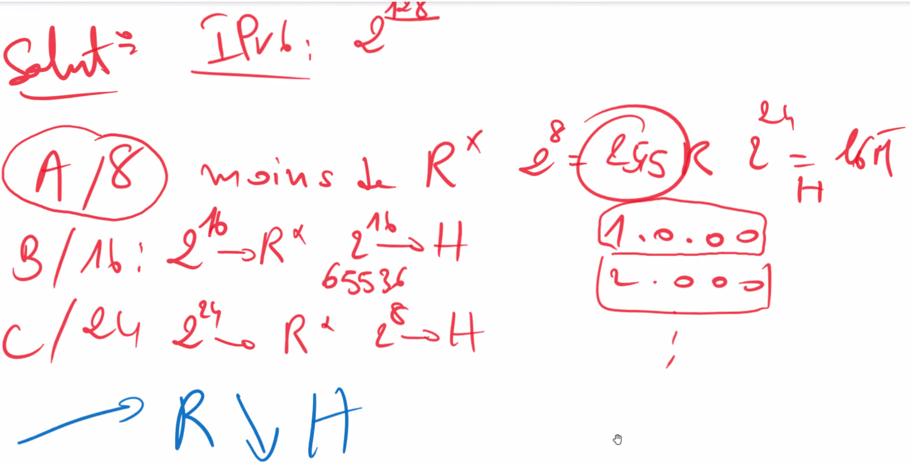

IANA : Internet Assign Number Authority. Organisme qui s'occupe des IP

Récupération d'adresses privées et publiques

### Classes

#### Classe A

A /8

1-> 127

1.0.0.0 -> 9 . 255. 255. 255 : Adresses publiques

10.0.0.0 -> 10 . 255 . 255 . 255 : Adresses privées

11.0.0.0 -> 126 . 255 . 255 . 255 : Adresses publiques

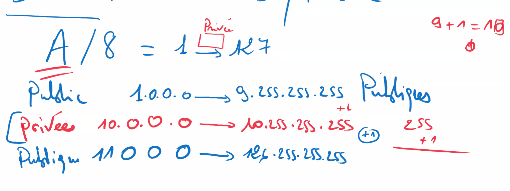

127 : adresse iP réservée aux tests de la pile TCP-IP. Voir si la carte réseau est correcte ou pas. 16M d'adresses qui ne servent qu'à ça.

0.0.0.0 / 0 : Réservée au routage par défaut. (toute direction)

#### Classe B

B /16 : 255 . 255 . 0 . 0

Publique  : 128 . 0 . 0 . 0   -> 172 . 15 . 255 . 255

Privée      : 172 . 16 . 0 . 0  -> 172 . 31 . 255 . 255

Publique  : 172 . 32 . 0 . 0  -> 191 . 255 . 255 . 255

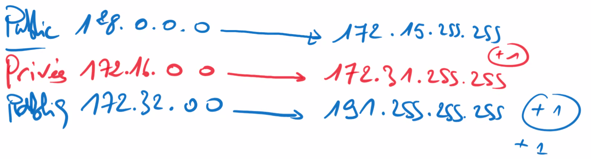

Adresse APIPA : 169.254 /16 est une adresse réservée utilisée pour les clients qui ne trouvent pas de serveur DHCP.

#### Classe C

C / 24

Publique : 192 . 0 . 0 . 0      -> 192 . 167 . 255 . 255

Privés : 192 . 168 . 0 . 0       -> 192 . 168 . 255 . 255

Publiques : 192 . 169 . 0 . 0 -> 223 . 255 . 255 . 255

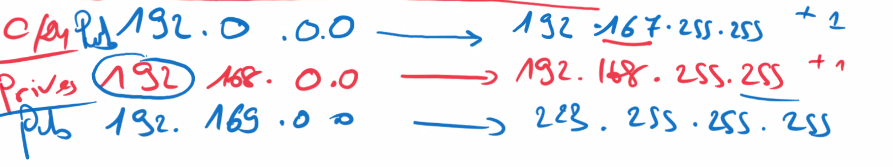

#### Classe D

224 -> 239

#### Classe E

240 -> 255

#### Résumé

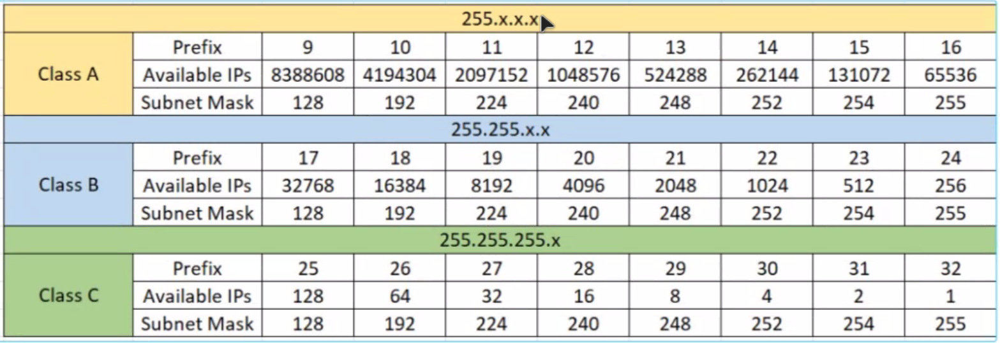

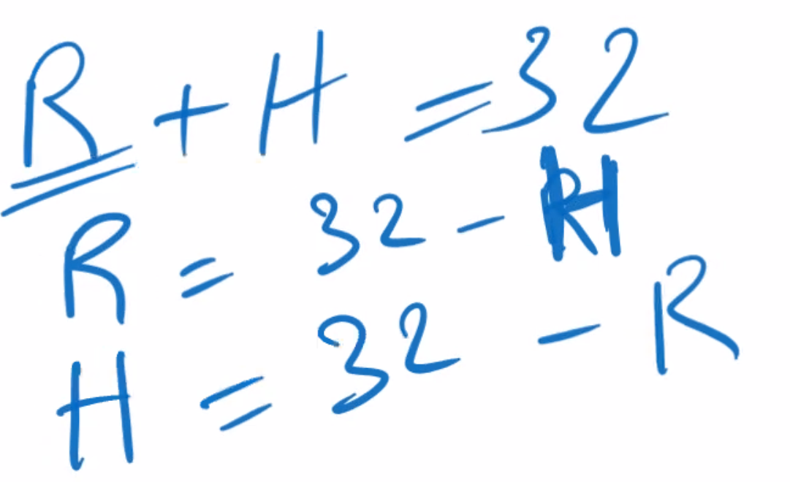

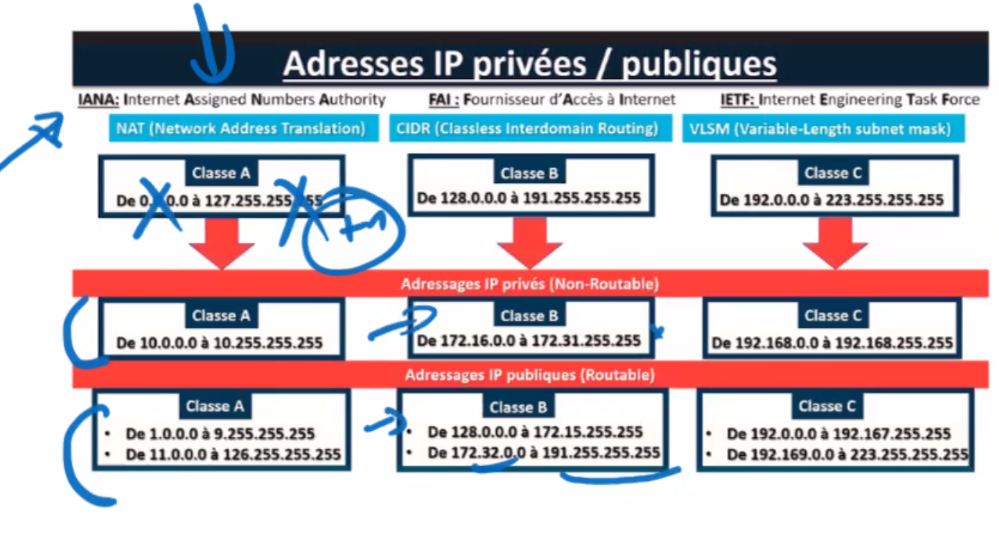

CIDR : Classless Inter-Domain Routing

**& logique**
@ IP : soit Rx, soit host, soit broadcast
On multiplie l'adresse IP par le masque en binaire pour obtenir l'adresse réseau.

**Passerelle**
La passerelle par défaut d'une machine indique le routeur à contacter lorsque l'on doit envoyer des données -> faux ?

## Projet

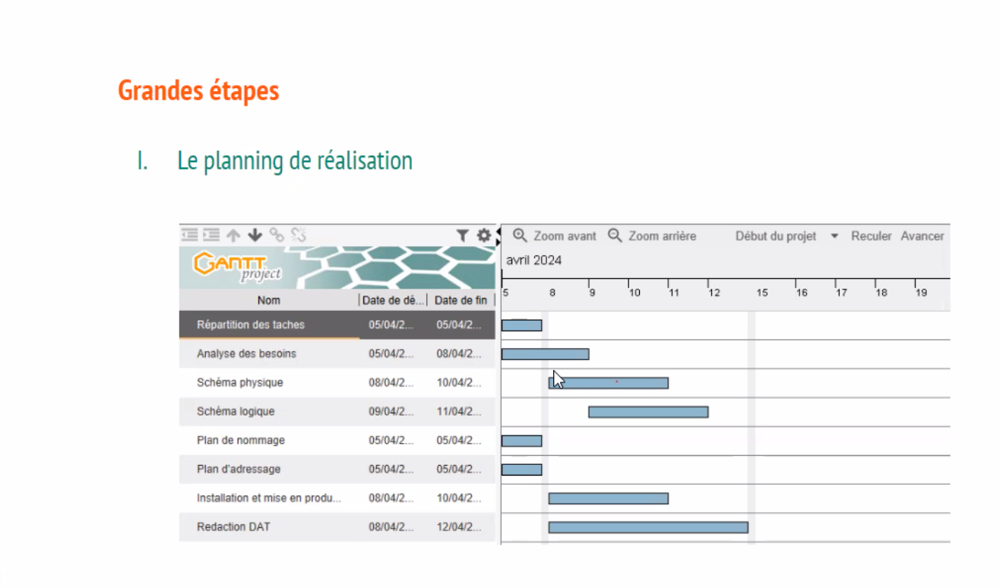

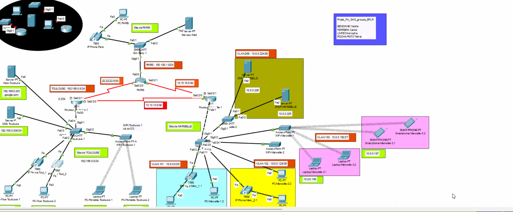
