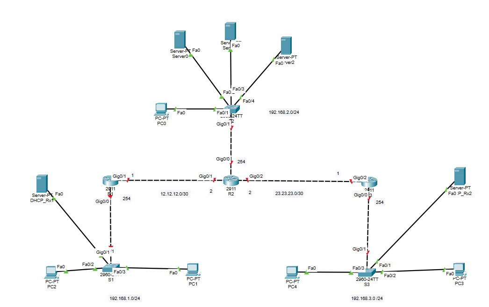
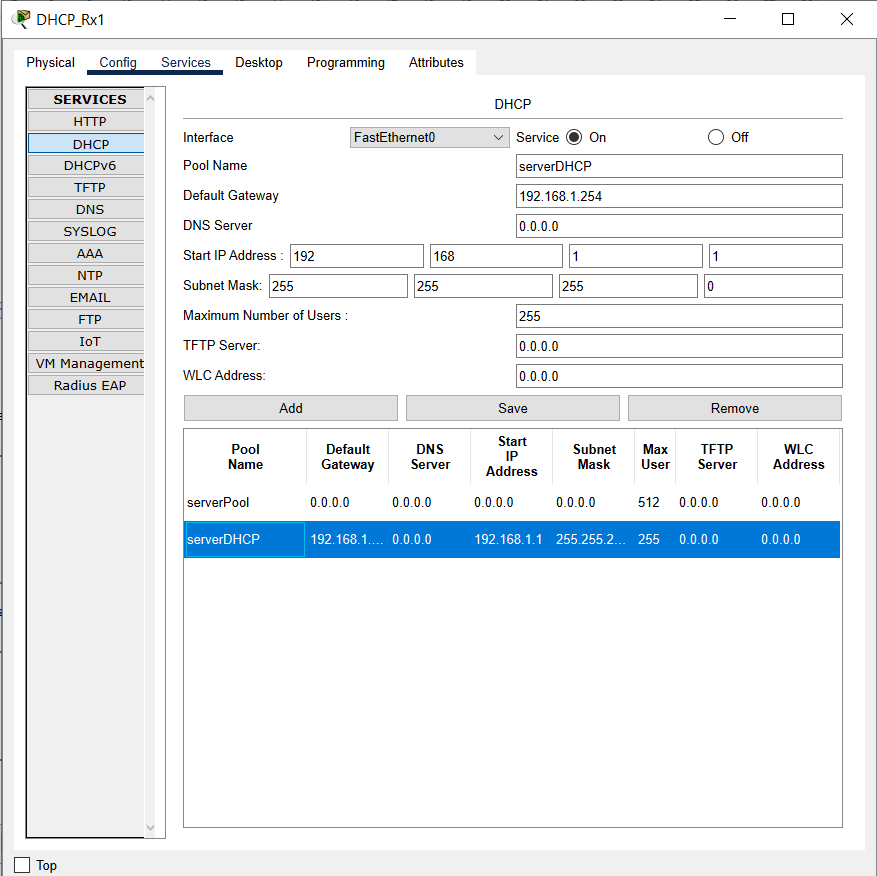
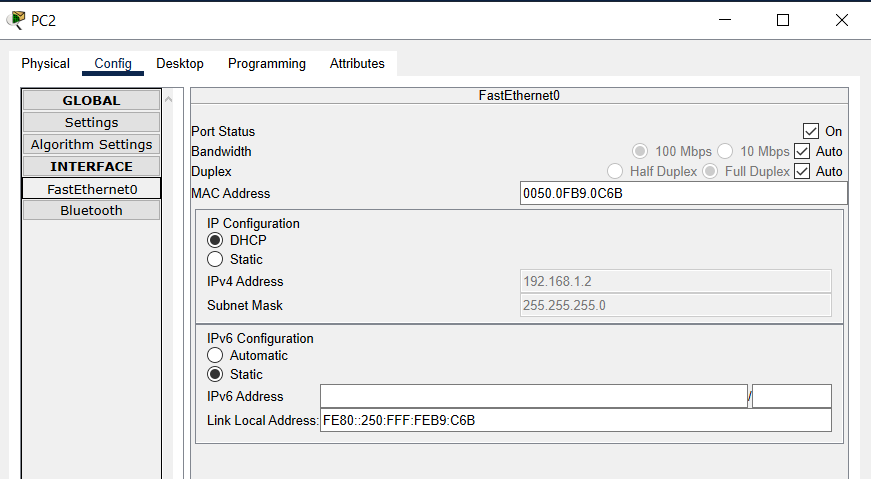
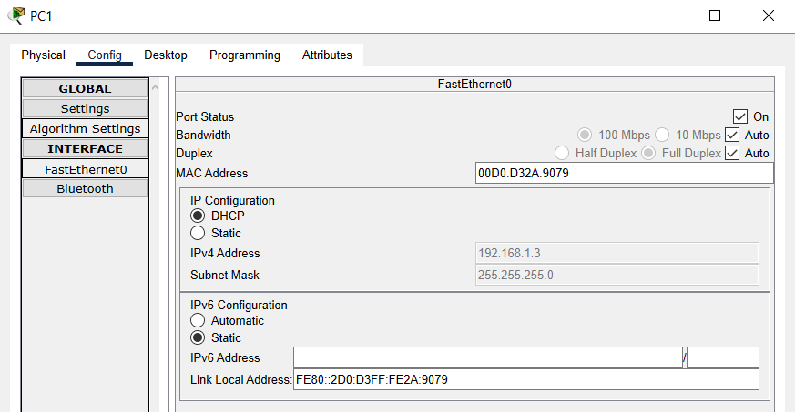
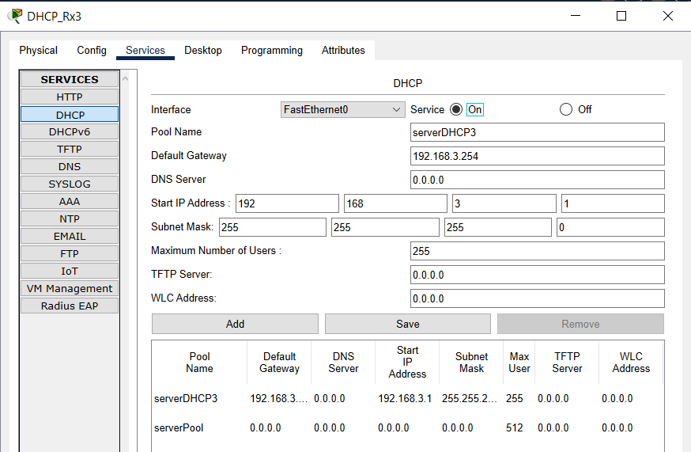
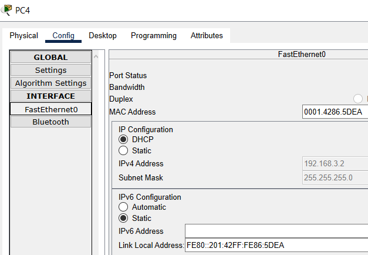
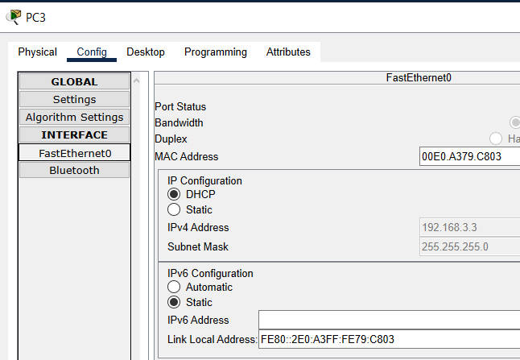
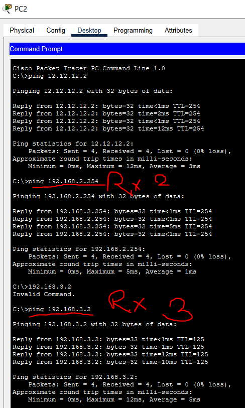

[Voir le cours sur le routage](/notes/réseaux/routage)

On mets d’abord en place le TP :


## Exercice 1

:::note[Exercice 1]
Renommer les 3 switches S1, S2, et S3 respectivement en SW-Site1, SW-Site2 et SW-Site3
:::

```txt
S1  
****  
en  
conf t
hostname SW-Site1
do write
  
S2
****
en
conf t
hostname SW-Site2
do write

S3
****
en
conf t
hostname SW-Site3
do write
```

## Exercice 2

:::note[Exercice 2]
Renommer les 3 routeurs R1, R2, et R3 respectivement en TR-Site1, RT-Site2 et RT-Site3
:::

```txt
R1
****
en
conf t
hostname RT-Site1
do write

R2
****
en
conf t
hostname RT-Site2
do write

R3
****
en
conf t
hostname RT-Site3
do write
```

## Exercice 3-5

:::note[Exercice 3-5]
Saisir les adresses des interfaces le Routeur 1
:::

Tout d’abord, on définis les adresse de passerelle :

|  Interfaces |        RT1        | RT2                | RT3               |
| :---------: | :---------------: | ------------------ | ----------------- |
| Interface 0 | 192.168.1.254 /24 | 192.168.2.254 / 24 | 192.168.3.254 /24 |
| Interface 1 |   12.12.12.1 /30  | 12.12.12.2 /30     | -                 |
| Interface 2 |         -         | 23.23.23.2 /30     | 23.23.23.1 /30    |

Résultat : 



Configuration : 

```txt
R1
****
int g0/0
no shutdown
ip address 192.168.1.254 255.255.255.0
int g0/1
no shutdown
ip address 12.12.12.1 255.255.255.252 

R2
****
int g0/0
no shutdown
ip address 192.168.2.254 255.255.255.0
int g0/1
no shutdown
ip address 12.12.12.2 255.255.255.252 
int g0/2
no shutdown
ip address 23.23.23.2 255.255.255.252 

R3
****
int g0/0
no shutdown
ip address 192.168.3.254 255.255.255.0
int g0/2
no shutdown
ip address 23.23.23.1 255.255.255.252 
```

## Exercice 6-7

:::note[Exercice 6-7]
Configurer le routage statique sur le Routeur 1
:::

```txt
R1
****
en
conf t
ip route 0.0.0.0 0.0.0.0 12.12.12.2
do write
```

## Exercice 8

:::note[Exercice 8]
Configurer le routage statique sur le Routeur 2
:::

```txt
R2
****
en
conf t
ip route 192.168.1.0 255.255.255.0 12.12.12.1
ip route 192.168.3.0 255.255.255.0 23.23.23.1
do write
```

## Exercice 9

:::note[Exercice 9]
Configurer le routage statique sur le Routeur 3
:::

```txt
R2
****
en
conf t
ip route 0.0.0.0 0.0.0.0 23.23.23.2
do write
```

## Exercice 10

:::note[Exercice 10]
Vérifier la connectivité entre chaque réseau avec sa passerelle (commande ping)
:::

```
R3
****
ping 12.12.12.1
ping 23.23.23.2

R1
****
ping 23.23.23.1
ping 12.12.12.2

R2
****
ping 12.12.12.1
ping 23.23.23.1
```

:::caution[Attention]
Je ne suis pas sûre de cette réponse
:::

## Exercice 11

On configure le serveur DHCP



## Exercice 12





## Exercice 13



## Exercice 14





## Exercice 15


