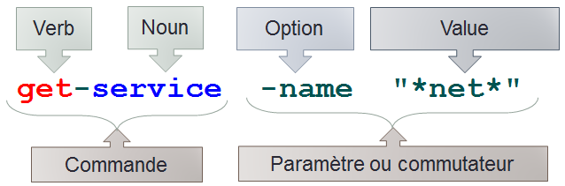

## Syntaxe

<https://www.it-connect.fr/powershell-pour-les-debutants-1ere-partie/#III_La_structure_des_commandes>

Powershell est un language orienté objet

## Commandes de base

|      Commandes     |                             Commentaire                             |
| :----------------: | :-----------------------------------------------------------------: |
|     `Copy-Item`    |                                 Copy                                |
|   `Move-Item`   |                                 Move                                |
| `Set-Location`  | Définit l'emplacement de travail actif sur un emplacement spécifié. |
|  `Rename-Item`  |                                Rename                               |
|   `New-Item`    |                                Create                               |
|    `Remove-Item`   |                                Remove                               |
|    `write-host`    |                                 echo                                |
| `$x= Read-Host ""` |                            comme `set /p`                           |
|        \`\`        |                                                                     |
|        \`\`        |                                                                     |

Variable :  Une information, une donnée figée que l'on stocke afin de rappeler des informations. L'information peut être de différents type.

`$var=donnée` : permet de définir une variable

`$var=$true` : assigne $var la valeur de la variable prédéfinie $true (booleen).

* Opérateurs arythmétiques : `+ - * / %`

* Opérateurs d'assignation : `-= ; += ; /= ; *= ; %= ;`

* Opérateurs de comparaison :

* `>` : comme sur linux, permet d'écrire dans un fichier (en écrasant son contenu)

* `>>` : permet d'écrire dans un fichier, à la suite du contenu de celui-ci

* en powershell, `"serveur 10" | Out-File -path path\serverlist.txt` est identique à `"serveur 10" >> path\serverlist.txt`

* `$serveurs | % {write-host "le nom du serveur est : $_" -ForeGroundColor green}`
