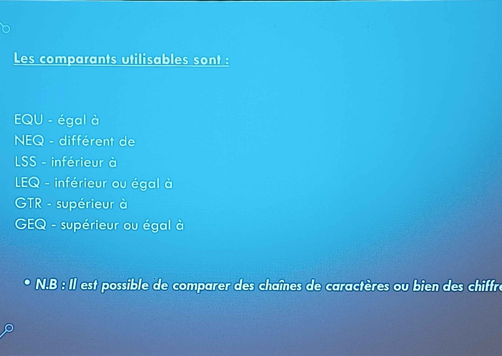

## Histoire

DOS = Disk Operating System\
Créé par Tim Paterson.\
Achat de DOS à Seatlle Computer par Microsoft en 1980

DOS existe toujours, via les commandes DOS. Mais ne joue plus un rôle central, on ne boot plus sur DOS.

### Frise chronologique

1981 : Disquettes 160ko\
82 : 360Ko\
83 : Disques durs : 10Mo\
84 : DD 40 Mo, disquettes 1.2Mo\
85 : Windows 1.0 indépendant du DOS, avec une interface graphique\
91 : Windows 3.0\
93 : Windows NT 3.1 basé sur noyau 32 bit.\
95 : Dos n'est plus distribué qu'avec Windows. Possible de démarrer "en mode DOS".\
97 : Windows 95 supporte l'USB et les cartes graphiques avec bus AGP.\
98 : Win 98\
99 : Win 98 SE\
2000 : Windows 2000 successeur de NT, support PnP, usb, Direct X\
Il s'appellera Windows XP.

## Commandes de base

`robocopy` = copie répertoire, fichier, en conservant les droits\
`format` = efface le contenu d'un lecteur\
`cls` = clear screen\
`sort` = permet de trier une liste en fonction d'un critère\
`print` = Imprime le fichier\
`type` = affiche un fichier (pareil que `more`)\
`FC` = comparaison de fichiers\
`attrib` = modifie les attributs d'un fichier\
`calcs` = modifie les droits utilisateurs sur un fichier

`chdir` = position ou l'on est actuellement

### Commandes réseau

`ping` = ping\
`ipconfig` =\
`netstat` =\
`net share`\
`netuse` = connecte un\
`tracert` = affiche les adresses de toutes les passerelles (equivalent : `pathping`)\
`arp` = affiche la table de correspondance MAC, les tables ARP, IP des machines sur le réseau\
`telnet` = ssh sans sécurité\
`net send` = unvoie un message sur une machine sur le réseau. Plus vraiment utilisé.\
`nslookup` = permet de faire une résolution DNS\
`ftp`\
`rexec` = execute une commande sur une hôte distant executant lui aussi REXEC\
`tftp` = transfère les fichiers depuis et vers un ordinateur distant executant ...\
`runas` = executer une commande avec un compte utilisateur différent du sien\
`net time` = permet de syncroniser l'horloge ave un serveur. port : 123.\
`mode` = permet d'afficher des informations concernatn les ports COM\
`netsh` = permet de configurer des interfaces réseau\
`route` = permet de gérer la table de routage de la machine locale (ex : C> route print )\
`nbstat` =

### Utilitaires windows

`defrag` = défragmenter un lecteur

`chkdsk` =

`net start`

`cleanmgr`

`convert`

### Commandes dédiées aux scripts

`pause` = permet de stopper le traitement en cours en demandant à l'user de taper une touche pour continuer

`if` =

| Colonne 1        | Colonne 2                                          |
| :--------------- | :------------------------------------------------- |
| `pause`          |                                                    |
| `if`             |                                                    |
| `for`            |                                                    |
| `set`            |                                                    |
| `goto`           |                                                    |
| `setvarname`     | crée une variable                                  |
| `setlocal`       | crée une variable locale                           |
| `timeout`        | crée une temporisation avec un réglage en secondes |
| `ping localhost` | permet de créer ???                                |
| \`\`             |                                                    |
| \`\`             |                                                    |
| \`\`             |                                                    |
| \`\`             |                                                    |
| \`\`             |                                                    |

Le `~` permet de découper une commande.

`~0,10` = affiche les 10 premiers charactères de la commande après la position 0.\
`~3,10` = affiche les 10 premiers charactères de la commande après la position 3.\
`~3,-10` = affiche les 10 premiers charactères de la commande après la position 3.

| Colonne 1 | Colonne 2 |
| :-------: | :-------: |
|    \`\`   |           |
|    \`\`   |           |
|    \`\`   |           |
|    \`\`   |           |
|    \`\`   |           |
|    \`\`   |           |
|    \`\`   |           |

