Linux est un système d'exploitation.\
Nous allons d'abord voir l'historique des Systèmes d'exploitation.

## Histoire des OS

En 1964 : Une société, AT\&T (Bell), le MIT et General Eletric se sont réunis pour concevoir un système d’exploitation appelé Multics. Il est développé en Assembleur un langage très complexe.

1968 : GE + MIT abandonnent le projet.

1969 : Un language est créé, le langage B est créé, le Basic. Bien plus simple que l'Assembleur. AT\&T : reprogramme Multics en langage B. Devient Unics (car une seule société sur le projet).

1970 : Horodatage de l'informatique (naissance de l'informatique).

1972 (?) : Langage C.  On re-code Unics, qui devient Unix.

1976 : Accord entre Bell (AT\&T) et l'université de Berkley (il faut former des étudiants à Unics). Bercley crée la fondation BSD : Berkeley Software Distribution. C'est grave, car c'est Berkeley qui s'approprie le système (le contrat n'était pas très solide).\
BSD (?) : NDA = Non-Distribution Agreement = Quiconque bénéficie du code source doit cotiser.

IBM, HP, Sun (Solaris), Apple : Toutes ces entreprises cotisent à la fondation pour obtenir le code source.

IBM modifie le code source -> AIX\
HP -> HP-UNIX\
Sun -> Solaris (?)\
Apple -> Mac

Richard Stallman : Pas satisfait des événements avec la BSD. Pas d'accord avec la vente du système, défend l'open-source.\
Il crée le projet GNU (= GNU is Not Unix) avec le langage C.\
Il veut protéger le code source de GNU, donc il crée la fondation FSF : la Free Software Fondation. Il crée une license GLP = General Public License.\
Il continue à développer des applications (des commandes).

1991 : Linus Trovaldos, pendant son projet de doctorat, va développer un kernel (noyau).\
Kernel : couche qui comminque entre les commandes et le hardware. Permet la gestion des ressources (DIsk, Stockage, RAM, CPU, carte mère, GPU (carte graphique), etc.).\
Il l’appelle Minix.\
Il le développe pour qu'il soit multitache et multi-utilisateur.\
Il lui manque la partie Shell avec les applications (commandes), donc il fait une annonce :\
Il cherche une collaboration pour les applications. Richard Stallman réponds.\
Cela devient Linux.

1993 : deux distribution sont développées :

* Debian, qui est gratuite
* Red Hat, qui est payante, avec un support inclus.

Plus tard, à partir de la distribution Debian, Ubuntu est crée. Fedora est crée à partir de Red Hat.

Ubuntu : 2 versions chaque année, en avril et en octobre. Pour 2024 : 24.4 et 24.10.\
Ubuntu sers un peu de la version test d'Ubuntu. Debian est réputée comme **stable**.

De son côté, RedHat fait la même chose qu'Ubuntu avec Fedora, une version tous les 18 mois.

Depuis 2 ans, IBM a racheté RedHat donc a arrêté CentOS (qui était la version gratuite de RedHat). C'est pour cela que Rocky Linux existe depuis.

:::tip[Tip]
Pour avoir des infos sur les différentes distribution linux :  <https://distrowatch.com> (surtout la carte des distribution)
:::

## Ligne de commande Linux

Pour plus de commandes, voir le fichier \[LinuxCheatSheet (.xlsx)]\("/Serveur Linux\_docs/LinuxCheatSheet.xlsx").

### Commandes de base

|       Commandes      |                 Commentaire                |
| :------------------: | :----------------------------------------: |
|         `--h`        |                    help                    |
|    `man <command>`   | permet d'afficher le manuel de la commande |
|      `man -k ls`     |    affiche la liste de tous les manuels    |
|         `cd`         |              change directory              |
|        `mkdir`       |               make directory               |
|         `cp`         |                    copy                    |
|         `ls`         |                    list                    |
|        `ls -l`       |      liste en liste (avec les droits)      |
|        `ls -a`       |         montre les fichiers cachés         |
| `touch <nomFichier>` |            crée un fichier vide            |
|       Commandes      |                 Commentaire                |
|         `--h`        |                    help                    |
|    `man <command>`   | permet d'afficher le manuel de la commande |
|      `man -k ls`     |    affiche la liste de tous les manuels    |
|         `cd`         |              change directory              |
|        `mkdir`       |               make directory               |
|         `cp`         |                    copy                    |
|         `ls`         |                    list                    |
|        `ls -l`       |      liste en liste (avec les droits)      |
|        `ls -a`       |         montre les fichiers cachés         |
| `touch <nomFichier>` |            crée un fichier vide            |
|    `cat > fichier`   |    permet d'éditer rapidement un fichier   |
|     `shutdown -h`    |                                            |
|       `reboot`       |                                            |
|      `poweroff`      |                                            |

### Ligne de commande linux

`[sysadmin@localhost ~]$`\
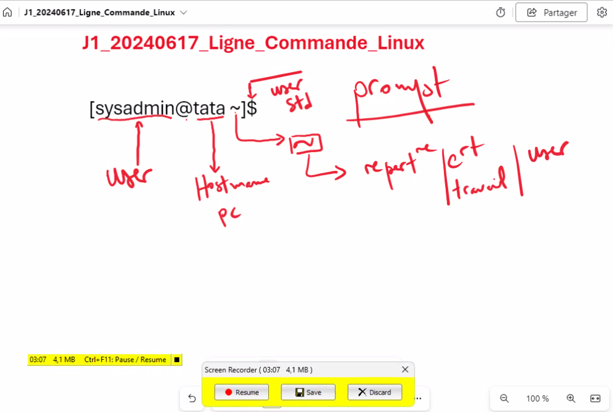


`whoami` = Connaître le compte connecté\
`hostname` = voir le hostname\
`pwd` =  voir le chemin ou on se situe\
`cat /etc/passwd`  = voir la liste des utilisateurs\
`tty` = numéro du terminal utilisé\
`cat /etc/hostname` = voir la liste des hostname

`sudo -i` = se connecter en root\
`nano /etc/hostname` = pour modifier le hostname

`shift+ctrl+n` = ouvrir une nouvelle fenêtre\
`chvt 1` = virtual type (?)

### Commandes d'affichage

`ls -all` : veut dire `-a -l -l`\
`ls --all` : veut dire `all`, donc la même commande que `-a` . Les deux `--` permettent de donner un mot complet pour une option

`cat` : affiche le contenu d'un fichier\
`tac` : inverse l'ordre de `cat`\
`more /etc/passwd` : affiche le contenu du fichier passwd, fenêtre par fenêtre. Pas possible de faire des recherches ?\
`less /etc/passwd` : comme less mais on peut faire une recherche\
`head /etc/passwd` : affiche les 10 premières lignes d'un fichier\
`head -n 5` : affiche les 5 premières lignes\
`tail` : affiche les 10 dernières lignes d'un fichier

La commande `echo` est une commande interne au shell. Elle renvoie ce qu'on lui donne.

```shell
sysadmin@localhost:~$ echo $PATH
/home/sysadmin/bin:/usr/local/sbin:/usr/local/bin:/usr/sbin:/usr/bin:/sbin:/bin:
/usr/games:/usr/local/games:/snap/bin
```

La commande a bien renvoyé le `$PATH`.

```shell
sysadmin@localhost:~$ whereis echo
echo: /bin/echo /usr/share/man/man1/echo.1.gz
```

:::tip[Question d'examen]
A quoi correspond la variable $PATH ?
<https://doc.ubuntu-fr.org/variables_d_environnement>
:::

## Système de fichier

Comment est structuré le système de fichier de Linux.\
Arbre inversé : racine -> tronc -> branches.

Racine (root) : `/`

Branches :\
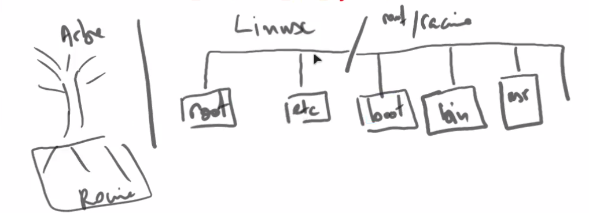

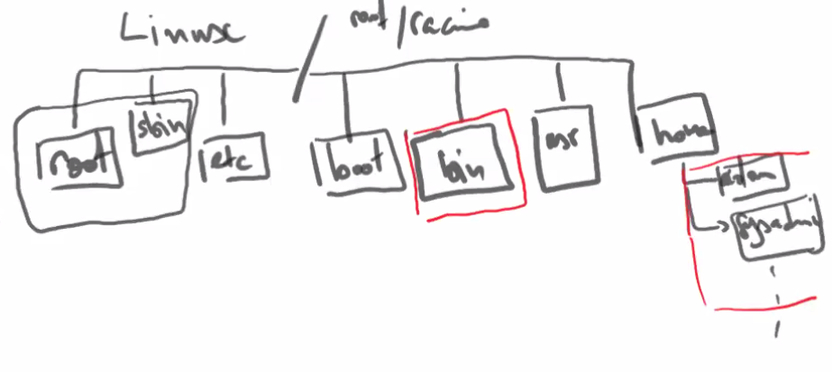

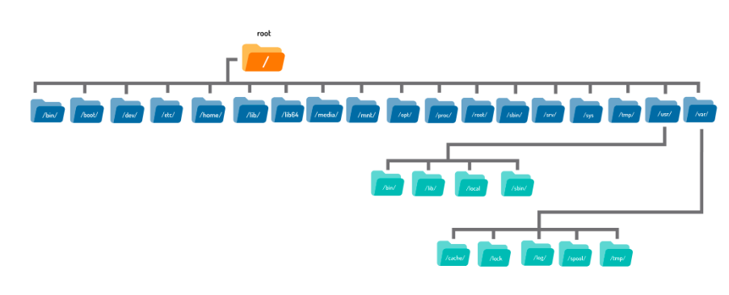

* `/sbin` : binaries du répertoire de `root`. `bin` : binaires des utilisateurs.
* `/etc` : Répertoire des configurations système

  :::tip[Question d'examen]
  Ou se situe la liste des utilisateurs sur linux ?
  -> dans `/etc/passwd`
  Comment y accéder ?
  -> `cat /etc/passwd` ou `less` ou `more` ou `tail` ou `head`, etc.
  Ou se situent les mots de passe ?
  -> `/etc/shadow`
  Ou se situent les groupes ?
  -> `/etc/group`
  :::

  * `/etc/passwd`:
    root = user; x = existence d'un mdp ; 0 = UUID ; 0 = GUID ; `/bin/bash` = représente un shell / terminal
    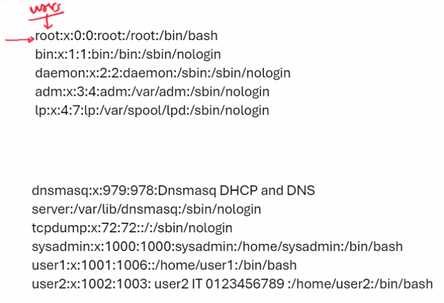
  * `/etc/shadow` :
    Mots de passe stockés de manière 'chiffrée'. (on dit qu'ils sont hashés (hash)).
    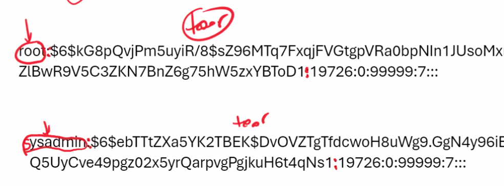
    Le `$6$` représente l’algorithme de chiffrement. Après les `:` à la fin du hash, on a l'horodatage. `19726` = Nombre de jours après 1970 ; `0` nombre de jours avant de pouvoir changer le mot de passe; `99999` = nombre de jours avant le renouvellement du mot de passe ; `7` = nombre de jours avant l'avertissement de renouvellement de mot de passe.

:::note[Note sur le kernel]
Le kernel (noyau) fait le lien entre le hardware et le software.
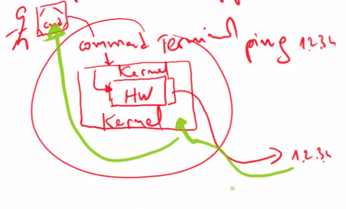
:::

## Gestion des utilisateurs, des groupes et des droits

### Rappel

Système de fichier :

root = racine = `/`

* `/etc` = configuration du système. -> `/password` ; `/shadow`; `/group`.
* `/bin` = commandes
* `/usr/bin` = commandes users standards
* `home` = contient les fichiers des utilisateurs standarts
* `root` = contient les fichiers de l'utilisateur root
* `sbin` = contient les binaires de l'utilisateur root

### Utilisateurs

3 types d'users: admin, standards, applications

1->999 = applications\
1000 = 1er utilisateur standard

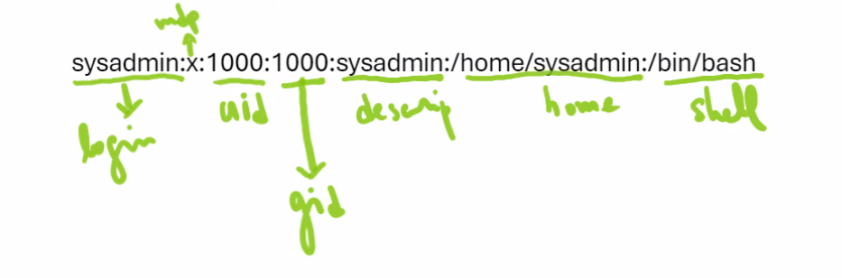

Groupe primaire = `gID`\
Groupe secondaire = `GID`

:::tip[Mémo]
`g` > `G` dans la table ASCII (les minuscules ont des valeurs plus petites que les majuscules)
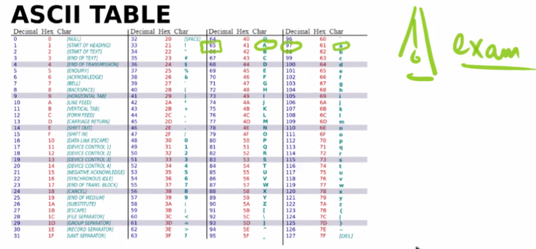
:::

:::note[Note sur les processus]
Processus = application lancée dans la mémoire

1er processus qui se lance sur debian : initd\
1er processus qui se lance sur Rocky : systemd

PID = Process ID\
PPID = Parent Process ID

`ps -aux` = voir la liste des process :

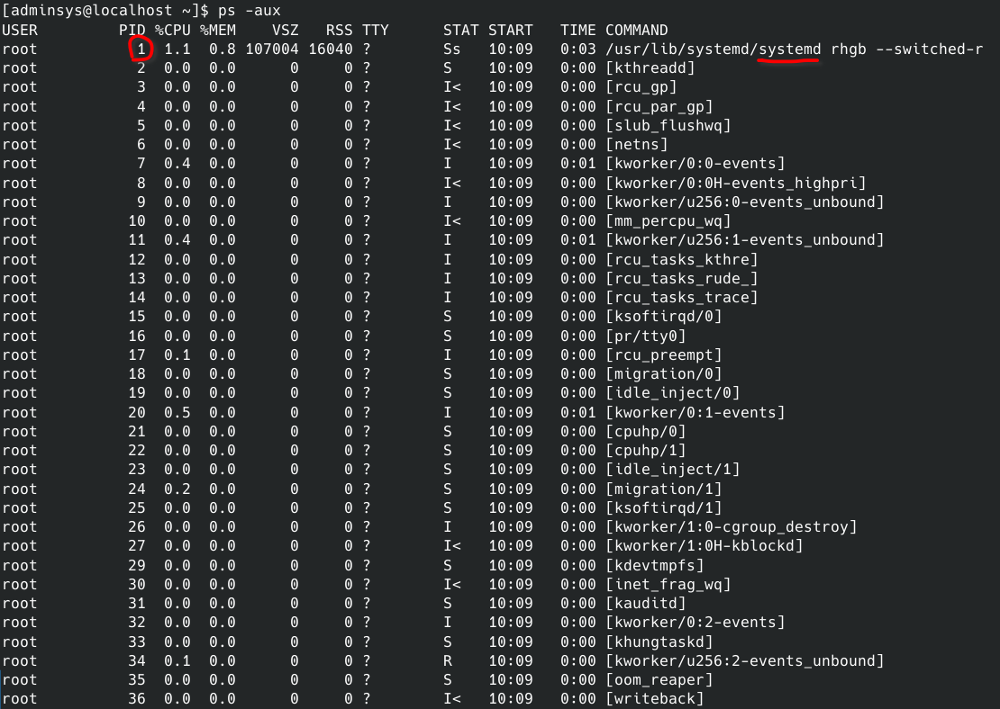

`pstree` = permet de voir l'arbre des process :

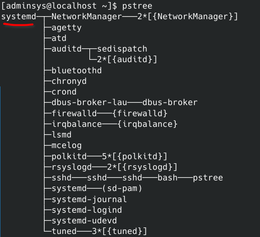

Le 1er processus lancé (`systemd`) va lancer les autres processus.

:::

### Créer un utilisateur

`adduser` (avec un prompt) ou `useradd` (pour faire un script, en une seule ligne).

:::caution[Attention]
`adduser` ne donne pas de prompt sur une distribution RedHat.
:::

Le hash est 'salé' avec une fonction aléatoire, donc même avec le même mot de passe, le hash n'est pas le même.

`usermod -s /sbin/nologin titi` = titi ne peut plus se connecter.

:::caution[Question d'examen : usermod]
`-g` et `-G`\
`usermod -G sysadmin titi` = assigne le groupe sysadmin à titi, **en supprimant les autres groupes secondaires**.\
`usermod -aG TSSR titi` = assigne le groupe TSSR à titi, sans supprimer les groupes secondaires existants\
`usermod -g sysadmin titi` = assigne le groupe *primaire* sysadmin à titi, sans supprimer les groupes secondaires existants
:::

`groupdel RH` = supprime le groupe RH si le groupe RH est vide.

:::note[Note sur le chiffrement]
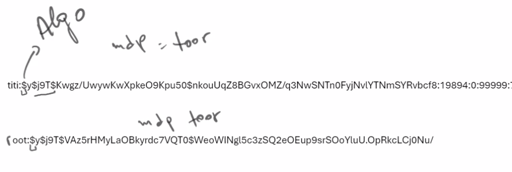

1er `$` = algorithme utilisé pour le hachage.\
2ème `$` = mot de passe\
3ème `$` = sel (salt)

MD5 et SHAA1 : peuvent provoquer des collisions (hash identiques pour messages différents). On utilise donc le SHAA2 ou plus sécurisé.

Sel = fonction aléatoire\
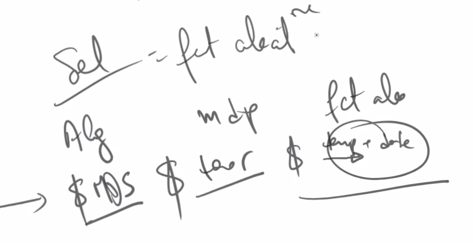

:::

### Droits

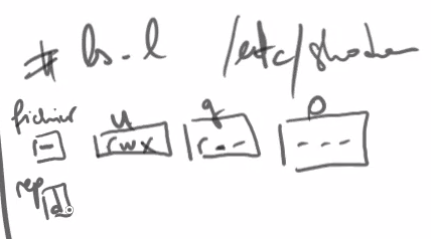

## Astuces

### Man Pages

6.2.3 :

To search a man page for a term, type the `/` character followed by a search term, then hit the **Enter** key. The program searches from the current location down towards the bottom of the page to try to locate and highlight the term.

If a match is found, it will be highlighted. To move to the next match of the term, press **n**. To return to a previous match of the term, press **Shift**+**N**. If the term is not found, or upon reaching the end of the matches, the program will report `Pattern not found (press Return)`.

6.2.4 :

```shell
man -k "copy file"
```

Permet de chercher une page de manuel avec les mots `copy file`.

Options man :

| Key                                   | Purpose                               |
| ------------------------------------- | ------------------------------------- |
| **H** or **h**                        | Display the help                      |
| **Q** or **q**                        | Quit the help or manual page          |
| **Spacebar** or **f** or **PageDown** | Move a screen forward                 |
| **b** or **PageUp**                   | Move a screen backward                |
| **Enter** or **down arrow**           | Move down one line                    |
| **Up arrow**                          | Move up one line                      |
| **/** followed by text to search      | Start searching forward               |
| **?** followed by text to search      | Start searching backward              |
| **n**                                 | Move to next text that matches search |
| **N**                                 | Move to previous matching text        |

### Rechercher un fichier

6.3.2 :

```shell
sysadmin@localhost:~$ locate -b "\passwd"
/etc/passwd
/etc/pam.d/passwd
/usr/bin/passwd
/usr/share/doc/passwd
/usr/share/lintian/overrides/passwd
```

### Changer le message pré-connexion

<https://www.cyberciti.biz/faq/howto-change-login-message/>

`nano /etc/issue`

### Changer le message de bienvenue après connexion

<https://www.adminmalin.fr/linux-personnaliser-message-bienvenue-shell/>

`nano /etc/motd`

## Archivage

### Tar

```shell
tar –cvf mybackups/udev.tar /etc/udev
```

* `-c` = utilise le format de compression tar.
* `-v` = verbose
* `-f` = permet de spécifier le nom de l'archive crée.

:::note[Information]
`tar` stands for **T**ape **AR**chive. This command was originally used to create tape backups, but today it is more commonly used to create archive files.
:::

:::caution[Attention]
You are not required to use the `.tar` extension to the archive file name, however, it is helpful for identifying the file type. It is considered "good style" when sending an archive file to another person.
:::

```shell
tar -tf mybackups/udev.tar # Permet de lire le contenu d'une archive
tar -tfv mybackups/udev.tar # Permet de voir les droits et de lister le contenu de l'archive comme un ls -l
```

* `t` = list contents
* `v` = verbose
* `f` = filename
