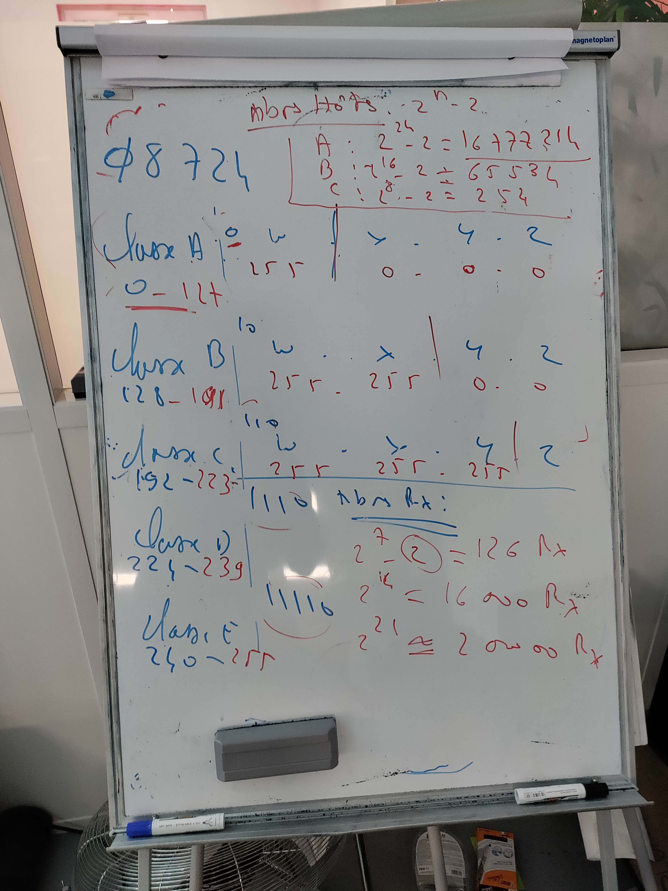

Windows 10 famille : Pas de GPO. Pas d'ajout sur le réseau. Pas d'HyperV.

Différentes façons d'installer Windows 10 :

* DVD
* Low-touch ave MDT
* Sans intervention avec MDT
* Configuration des packages avec l'ICD

Image / ISO : image = master = OS + apps + màj + pilotes. Différentes images suivant les métiers.

SCCM : outil Microsoft qui permet de déployer des images Microsoft. Outil complet qui permet de faire de l'administration système Windows. Très cher.

WDS : équivalent gratuit.

Erreur de mise à jour : rétrogradage automatique.

Si la mise à jour s'est bien déroulée, mais qu'il y a quand même des bugs, on a 10 jours pour rétrograder manuellement.

```
DISM /Online /Get-OsUnistallWindow /Value:60
```

## Windows RE

RE pour récupération / restauration

Une partition (généralement la dernière)

4 manières d'y accéder :

1. Paramètres > Récupération
2. shift+redémarrer
3. ISO windows
4. Eteindre 3 fois le PC par le bouton power

**Partition active** : partition utilisée pour le démarrage du système sur Windows.

## GPO

4 familles de GPO :

1. Local (sur chaque machine)
2. Site (Paris, Marseille...)
3. Domaine
4. OU

Forcer l'application d'une GPO :

```cmd
GPUPDATE /force
```

Editer les GPO locales :

```cmd
gpedit.msc
```

Voir les stratégies de groupes appliquées :

```cmd
GPRESULT /R
```

## Questions d'examen

Quels sont les 2 GPO par défaut quand tu installe un domaine ?

* Default Domain Policy

* Default Domain Controller Policy

* Qu'est-ce qu'une adresse IPv4 ?
  Permet d'identifier un hôte sur un réseau. 32bits (4 octets)
  Hôte : tout équipement qui a une carte réseau

* Qu'est-ce qu'un masque de sous-réseau ?
  Permet de distinguer la partie réseau de la partie hôte

**Calculer les classes**  :
A : 0  = 0
B : 10 = 128
C : 110 = 192
D : 1110 = 224
E : 11110 = 240

**Nb de réseau maximum** :
A = 2^7



Notation CIDR

Le CIDR est venu pour résoudre le problème de la pénurie d'adresse IP en se rapprochant du nombre d'adresse dont une entreprise à besoin.


2^r = 32 nombre max des sous-réseaux.

:::caution[Attention]
Les adresse IP privées sont en /8 /12 /16
:::

NAT = Transforme une adresse ip privée en public

Adresse IP privée : elle ne sont pas routables.

DHCP : implémentation de l'adresse IP automatique. L'adresse APIPA est l'adresse qui est attribuée si le serveur DHCP n'est pas joignable. Elle permet tout de même communiquer sur le LAN.

## Résolution de noms (DNS)

**Méthodologie de dépannage TCP/IP** :

1.

```
ipconfig
```

2.

```
ping 127.0.0.1
```

-> carte Rx fonctionne correctement

3.

```
Ping @ ip de l'hôte
```

-> Protocole TCP/IP fonctionne correctement

4.

```
ping @ ip de la passerelle
```

-> Routeur fonctionne correctement

5.

```
ping @ip de l'hôte distant
```

6.

```
Recommencer la procédure avec le nom 
```

## Types de noms des ordinateurs

|     Nom     |                                                           Description                                                           |
| :---------: | :-----------------------------------------------------------------------------------------------------------------------------: |
|  Nom d'hôte | - Peut comprendre jusqu'à 255 caractères<br>- Caractères alphabétiques et numériques<br>- Fait partie du nom de domaine complet |
| Nom Netbios |                                       - 15 caractères<br>- Intranet de l'entreprise (LAN)                                       |

Le DNS permet la résolution du nom d'hôte en @ ip dynamiquement (automatiquement). Serveur WINS permet la résolution du nom netbios en ip dynamiquement

Ancêtre du DNS : fichier host. Per la résolution DNS en DHCP, manuellement.

LM Hosts : Résolution du nom netbiois en IP manuellemenr. Se trouve dans %systemroot% (C:\Windows) : %systemroot%\system32\drivers

Après windows 10, il ont intégrés le serveur WINS dans le serveur DNS.


Méthode de résolution de noms :

1. Nom d'hôte local
   sysdm.cpl / hostname
2. Cache de résolution DN
   ipconfig /Flush
3. Fichier Hosts
   `%systemroot%\system32\???\etc`
4. Serveur NDN
   mmc -> DNS (vider le cache)

```
nslookup
> set all
```

## Active Directory

### Composants physiques

* **Le contrôleur de domaine** : Serveur windows dans lequel on a ajouté le rôle ADDS. Contient la base de données Active Directory. Rôle : il authentifie les objets (utilisateurs, UO, ordinateurs, etc.) du domaines.\
  **RODC** : Contrôleur de domaine en lecture seule.
* La BDD Active Directory se situe dans le répertoire `NTDS.DIT`. Les scripts, les GPO, etc. sont dans `sysvol`.
* Le serveur catalogue global contient des attributs (nom, prénom, adresse) des objets de la forêt. Il permet d'effectuer des recherches rapides.

### Composants logiques

* Les partitions = sections de la BDD Active Directory
* Le schéma Active Directory
* Le domaine = limite administrative pour les objets utilisateurs et ordinateurs
* Une arborescence de domaine = contient une suite de domaine qui partage un espace de nom contiguë.
* La forêt AD =  contient l'arborescence des domaines AD.
* Le site AD = découpe un domaine en plusieurs parties, afin de limiter et contrôler la réplication entre deux sites distants.
* L'unité d'organisation = permet d'**appliquer une stratégie de groupe (GPO)** mais également de **mettre en place une délégation** (exemple : déléguer une tâche d'administration à un technicien).
* GPO :

### Le Domaine Active Directory

**Définition**: Un domaine AD est un regroupement logique de comptes utilisateurs, ordinateurs ou de groupes.
Ressources : dossier, fichier ou périphérique.
Les objets qui sont créés sont stockés dans une BDD nommée NTDS.DIT, elle peut stocker pls types d'objets :

* Le compte utilisateur
* Le compte ordinateur
* Les groupes

### Les Unités Organisationnelles

Les unités d'organisation (OU) sont des objets conteneurs qui permettent le regroupement de comptes utilisateur ou / et d'ordinateurs ....

### Le schéma Active Directory

Par défaut le schéma AD est caché :

`CTRL+R` : `regsvr32 schmmgmt.dll`

### Les partitions de l'Active Directory

L'AD est composé de plusieurs partitions.

### Les maîtres d'Opérations FSMO

Il en existe 5 :

* Deux présents uniquement sur un des contrôleurs de domaines de la forêt, les 3 autres se trouvent sur chaque domaine
* Rôle maître de schéma
* Rôle maître de dénomination de domaines
* ...

### Les sites AD et la réplication

Les domaines sont découpés en sites AD, représentant la topologie physique de l'entreprise

### Le contrôleur de domaine

RODC : contrôleur de domaine en lecture seule

### SYSVOL

Système volume.\
Stocké dans `c:\windows\sysvol\`\
On y retrouve les scripts de connexion et les stratégie de groupes (GPO)

### Stratégie de groupe : GPO

Une GPO contient un ou plusieurs paramètres pour les utilisateurs et ordinateurs.

* Stockées dans sysvol et gérées par gpmmc ??

Ordre d'application d'une stratégie de groupe :

1. Local
2. Site
3. Domaine
4. OU

* Est-ce qu'une GPO peut être appliquée à un groupe ? Un utilisateur ? Un ordinateur ? Non.\
  C'est à l'OU que l'on applique une PGO.
* En cas de conflit entre un paramètre de deux stratégies différentes, c'est la dernière appliquée qui l'emporte.
* Forcer (ou appliquer) une stratégie.
