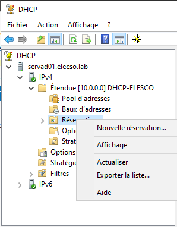

[TP01 (PDF)](/notes/serveur-windows/_docs/TP01_Elesco.pdf)

## Préparation du TP


:::note
Le TP mentionne Windows Serveur 2019 et Windows 10, mais on va utiliser Windows Serveur 2022 et Windows 11 pour être plus à jour
:::

### Préparation Serveur Windows

Tout d'abord, on définis une adresse IP fixe :\
`ncpa.cpl`


Et on change le nom de l'ordinateur :

`sysdm.cpl`


Sur le serveur, sur la fenêtre d'Active Directory, on ajoute les rôles :

* Serveur DNS
* Contrôleur de domaine AD
* Serveur DHCP
* Serveur FSRM

:::caution[Attention]
Il vaut mieux ajouter et configurer l'AD **avant** le serveur DNS
:::


#### Configurer le serveur DHCP :

<https://learn.microsoft.com/fr-fr/windows-server/networking/technologies/dhcp/quickstart-install-configure-dhcp-server?tabs=gui>

#### Configurer le contrôleur de domaine

<https://www.it-connect.fr/active-directory-adds-ajouter-un-controleur-de-domaine-a-un-domaine-existant/#V_Promouvoir_le_serveur_en_tant_que_controleur_de_domaine_ADDS>


### Partitionner le disque

Diskpart

```
diskpart
list disk
sel disk 0
create part primary
format fs=NTFS quick label=data
assign letter E
```

### Préparation PC Windows 11

On va sur `ncpa.cpl`, IPv4 :


On va sur `sysdm.cpl` pour connecter le PC au domaine.


On redémarre le PC et on se connecte au compte administrateur sur le domaine ELECSO :


#### Installer les RSAT

<https://www.tech2tech.fr/comment-installer-rsat-sur-windows-10-version-1809-et-superieur/#Methode_1_Via_lajout_de_fonctionnalite_Windows>

#### Utiliser les RSAT

Une fois installées, on peut rajouter les RSAT à une MMC : `mmc`


## 1) UO, groupes et utilisateurs


## 2) Permissions NTFS sur les dossiers


Autorisation de partage pour Gestion :\


Autorisation NTFS pour Gestion :\


Autorisations de partage pour Informatique :\


Autorisations NTFS pour Informatique :

On ajoute les groupes aux autorisations NTFS :\


Voici le résultat des droits attribués :\


Autorisations de partage pour Direction :\


Autorisations NTFS pour Direction :\


## 3) GPO

On veut mettre un script au démarrage de l'ordinateur.

`gpedit.msc`

On va sur les paramètres de la GPO :\


On se connecte sur Jim Boston, on vois que les emplacements réseau sont bien installés :\


## 4) Quotas

* On va sur `fsrm.msc`
* On crée un modèle de quota :\
  
  

## 5) DHCP

Configuration de l'étendue DHCP :\


On paramètre la réservation d'IP pour POSTE01 :\


Il nous faut l'adresse MAC de POSTE01 :\


La réservation est active :\


On peut voir que la carte réseau de POSTE01 a bien 10.0.0.12 en adresse IP:\


:::caution[Attention]
Il vaut mieux prendre un ipconfig /all et mettre en surbrillance les éléments importants :\

:::
